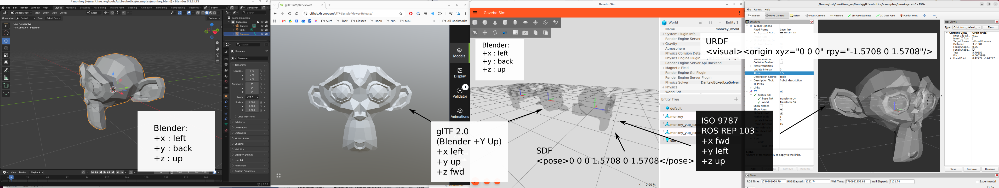

# Honu glTF Asset Profile 

This "profile" is based on the glTF 2.0 specification and interprets and constrains the specification for use in 3D asset authoring for robotic simulation.  This document, in combination with the companion [workflow](workflow.md), constitute actionable guidance for authoring and integrating robot 3D visual models. 

## Introduction

### Scope

This profile constrains the visual models authored for robotics simulation, currently mobile robots and specifically maritime robots. The aspiration is to generalize this, but at the current time we are prototyping the profile and workflow for this project and set of models. 

This profile builds upon [glTF 2.0](https://registry.khronos.org/glTF/specs/2.0/glTF-2.0.html) to make it actionable for 3D visual model integration in Gazebo for robotics. Every rule here does one of three things:

- **Narrowing.** This profile focuses and narrows the standard's affordances for the specific needs of robotics simulation, to make it actionable in the context of developing 3D visual robotic assets. A file can be glTF-compliant and still be unusable in a robotics simulator.
- **Adding.** Requiring something the standard does not, to satisfy the constraints of the robotics simulation and visualization consumers of the assets (e.g., Gazebo, RViz). This is required because some consumers implement only part of glTF, so a glTF-compliant asset is not guaranteed to be importable. Added constraints name the downstream consumer that motivates them.
- **Departing.** Differing from what the standard says, which would be done rarely and never silently. No rule departs at present. An earlier draft delivered the file in the robotics coordinate system, +X forward and +Z up, and that was reversed because no glTF tool could then show a part correctly; the file now follows glTF's own convention and the consumer makes the one conversion ([Axes](#axes)).

This profile is only about the visual 3D asset model and does not cover Collision geometry, inertia properties, joints, etc. 

## Document conventions

### Audience

This profile addresses two parties:

- **the modeler**, who authors and delivers a 3D visual asset
- **the integrator**, who integrates the asset as a functional robot component

### Normative terminology

The key words MUST, MUST NOT, REQUIRED, SHALL, SHALL NOT, SHOULD, SHOULD NOT, RECOMMENDED, MAY and OPTIONAL are to be interpreted as described in [BCP 14](https://www.rfc-editor.org/info/bcp14), and only when they appear in capitals.

### Informative language

Some text is purely informative, giving background or explaining why a guideline or rule exists.  All Notes, Implementation Notes and Examples are informative. Everything not so marked is normative.

### Open issues

Two kinds of text blocks mark open issues:

> **Open.** An open question that needs to be answered prior to first release.

> **Open: Future.** An open question that is TBD.  These issues are included for tracking purposes

## Terminology

The terms this profile uses are defined in the project [glossary](reference/glossary.md). Those definitions govern within this profile and supersede any other meaning the terms may carry elsewhere. Terms drawn from glTF keep their glTF meaning and are not redefined.

## Delivery

A delivery is a single `.glb` file carrying a single part. Everything in this section follows from that sentence.

### File

A delivery MUST consist of exactly one file, and that file MUST describe exactly one part. A compound object (a whole vehicle, or several parts carried as separate nodes in one file) MUST NOT be delivered.

> **Open: Future.** Whether a compound delivery is worth supporting later. The rule above is the minimal form and could be extended.

#### File naming

A delivery SHOULD be named `<part>.visual.glb`, where `<part>` is the part name.

The part name MUST be lowercase snake_case: lowercase letters, digits and underscores, beginning with a letter. It MUST NOT contain spaces.

#### File format

The visual model MUST be glTF 2.0 in the binary container, `.glb`, and that file MUST be self-contained: no external `.bin`, no external images, nothing to resolve at load time.

The file MUST validate against the Khronos glTF Validator with zero errors. Validator warnings and infos MUST be reviewed but do not by themselves fail a delivery.

**Implementation Note.** Why the binary container:

- gz-common 7.3.0 drops the glTF root rotation for a `.gltf` file and keeps it for a `.glb`, because it compares an already-lowercased extension against the literal `"glTF"`. A `.gltf` delivery would load into Gazebo mis-oriented and report nothing.
- Gazebo decodes every external texture when the mesh loads, not when a texture is first needed. A `.gltf` delivery with eight maps therefore pays eight image decodes at load time even for a part that is off screen, and the cost is paid again for every model that references the file.
- One artifact cannot arrive incomplete. A directory of six files can.

> **Open: Future.** Whether a delivery stays a single self-contained binary file. Today it is: one `.glb`, textures embedded, nothing to resolve at load time and nothing that can arrive incomplete. That is the KISS form and it governs. This one block tracks every way of going beyond it:
>
> - permitting `.gltf` with a side `.bin`, which would reach Drake, the one consumer that cannot read `.glb` at all ([Closely related work](#closely-related-work-informative))
> - permitting external texture files, which version independently in git so re-authoring one map does not rewrite the geometry, and which a consumer can load lazily
> - either of the above once the two defects behind the current rule are fixed upstream: the gz-common extension-comparison bug, and Gazebo's eager texture decoding

#### glTF structure

Each rule is stated normatively where it belongs and repeated here only as a list:

| | Rule | Stated in |
|---|---|---|
| One part | the file describes exactly one part | [File](#file) |
| One scene | exactly one scene, listing only the node | [Scenes and nodes](#scenes-and-nodes) |
| One node | exactly one node, no children | [Scenes and nodes](#scenes-and-nodes) |
| No transform | that node carries no `translation`, `rotation`, `scale` or `matrix` | [Scenes and nodes](#scenes-and-nodes) |
| One coordinate system | ; Blender (global, local); glTF (scene space, node space) and the origin coordinate system and the datum coordinate system all  coincide | [Glossary](reference/glossary.md#datum-coordinate-system), [Origin](#origin---datum-coordinate-system-location) |
| One mesh | one and only one mesh on that node | [Primitives](#primitives) |

**Implementation Note.** The rules above ensure that a delivered file is a single part in a single coordinate system, with nothing in its structure that a consumer could compose differently or lose. Everything that would express placement or hierarchy belongs in the robot description, not in the glTF geometry.

#### The manifest

A delivery MUST carry a manifest.

The manifest MUST be expressed as [`KHR_xmp_json_ld`](https://github.com/KhronosGroup/glTF/tree/main/extensions/2.0/Khronos/KHR_xmp_json_ld) metadata attached to the glTF `asset` object.  This is a ratified Khronos extension to read and write metadata. That extension is listed in `extensionsUsed` and MUST NOT appear in `extensionsRequired`. Metadata has no effect on appearance, so a consumer that ignores it is behaving correctly.

One property is the required minimum:

| Property | Type | What it records |
|---|---|---|
| `gltfrp:partRole` | Choice: `base`, `component` | Whether this part establishes a vehicle's reference coordinate system, or attaches to one. The [Datum specification](#datum-specification) section imposes more on a `base` |

Two properties record the datum ([Datum specification](#datum-specification)):

| Property | Type | What it records |
|---|---|---|
| `gltfrp:datumPoint` | Text | REQUIRED for a `base` part; a `component` part SHOULD carry it. The point, named as a feature of this part |
| `gltfrp:datumTarget` | Text | OPTIONAL. The physical realization, in the sense of ISO 5459 |

The remaining properties SHOULD be carried:

| Property | Type | What it records |
|---|---|---|
| `dc:source` | Text or URI | Where the geometry came from: the CAD file, the scan, the vendor model |
| `dc:creator` | Agent Name | Who authored it |
| `dc:date` | Date | When it was delivered |
| `dc:rights` | Text | Licensing, and for purchased textures the redistribution terms |
| `dc:relation` | URI | The published source the part's dimensions are cited from |
| `xmpMM:DerivedFrom` | ResourceRef | The authoring source (e.g., blend file), where one is archived |
| `gltfrp:nominalDimension` | Text | The cited figure itself, as a quantity with its dimension named and its unit (`m`, `cm` or `mm`), for example "length overall 1.146 m" |
| `gltfrp:dimensionTolerance` | Real | Meters. The band the measured extent is held to |

**Note.** This needs to be evaluated as we prototype the workflow.  This could be overkill.  

**Implementation Note.** What the `gltfrp` prefix is, and why it looks odd.

A manifest mixes properties from several vocabularies: `dc:creator` comes from Dublin Core, `xmp:CreatorTool` from Adobe's XMP schema, and `gltfrp:partRole` from this profile. A namespace is what keeps them from colliding. Dublin Core's `dc:source` and some future robotics `source` can coexist because the prefix says which vocabulary each belongs to. The prefix itself is a local shorthand; what identifies the vocabulary is the URL it expands to, declared once in the packet's `@context`.

The URL is an identifier, not an address. Nothing fetches it, at load time or ever, and a consumer with no network reads the manifest normally. It is a URL only because that is how XML and JSON-LD guarantee a name is unique without anyone maintaining a registry: whoever controls the domain controls every name under it, so no two vocabularies can accidentally claim the same one. That it also happens to resolve to this profile's documentation is a convenience for a human reading a file, not part of the mechanism.

Two details in the URL are deliberate. It carries `/1.0/` so that a later, incompatible set of properties can be given `/2.0/` and the two can coexist in one corpus without a file having to say which it meant. And it is named for the profile rather than for Honu Robotics, so that if this profile is ever adopted or maintained elsewhere the namespace does not have to move. Moving it would invalidate the vocabulary every already-delivered file declares.

### Asset header

`asset.version` MUST be `"2.0"`.

`asset.minVersion` SHOULD NOT be present.

**Implementation Note.**  The Khronos registry carries version 2.0 only, currently revision 2.0.1, and states that every update to it is a backwards-compatible patch; new capability arrives as extensions rather than as minor versions.

## Coordinate systems and units

The vocabulary this section uses (coordinate system, datum, origin, node space, scene space) is defined once in the [glossary](reference/glossary.md).

### Units

All linear distances MUST be in meters, at real-world scale, as glTF requires.

The Blender scene unit scale MUST be 1.0, and object scale MUST be applied before export. 

### Axes

The delivered file MUST be expressed in the coordinate system [glTF 2.0](https://registry.khronos.org/glTF/specs/2.0/glTF-2.0.html#coordinate-system-and-units) §3.4 defines: right-handed, **+Y up, +Z forward, −X right**. The front of the part faces +Z.

The coordinate systems used at each stage of the workflow are the based on the conventions of the tool or specification.

| Coordinate Convention| +x | +y | +z |
|---|---|---|---|
| Blender | left | back | up |   
| glTF 2.0 | left | up | fwd |
| ISO 9787   ROS REP 103 | fwd | left | up|

In Blender this is Blender's own convention: the part is built with its front toward −Y and up +Z, which is what Blender's Front view shows, and exported with the glTF exporter's `+Y Up` option **on**, which is the exporter's default. The exporter maps Blender (x, y, z) to glTF (x, z, −y), so Blender's front lands on +Z and Blender's up on +Y.

The robotics coordinate system of the part, +X forward, +Y left, +Z up ([ISO 9787:2013](https://www.iso.org/standard/59444.html) §5.5, [REP 103](https://www.ros.org/reps/rep-0103.html)), is reached by one fixed rotation that the consumer applies and the file never contains: robot (x, y, z) = glTF (Z, X, Y), which is a roll of 90° followed by a yaw of 90°. The rotation is about the origin, so the datum point is the origin in both coordinate systems.

| Consumer | What it does on load | What the integrator writes |
|---|---|---|
| Khronos Sample Viewer, browser viewers | assume glTF's convention | nothing: the part stands upright and faces the camera |
| Gazebo | no conversion; buffer data goes straight onto the link axes ([source](https://github.com/gazebosim/gz-common/blob/a08c258d4e566b1e1624cb85f12ab78068ab2870/graphics/src/AssimpLoader.cc#L955-L976)) | `<pose>0 0 0 1.5708 0 1.5708</pose>` on the visual |
| RViz, Lyrical and later | rotates a glTF mesh +90° about X as it loads, Y-up to Z-up ([source](https://github.com/ros2/rviz/blob/baab61a68bc089217dfaa4f270276dc7a30268b1/rviz_rendering/src/rviz_rendering/mesh_loader_helpers/assimp_loader.cpp#L215-L222)) | `<origin xyz="0 0 0" rpy="-1.5708 0 1.5708"/>` on the URDF visual |
| RViz, Jazzy and Kilted | no rotation: `ros2/rviz` #1482 was merged to `rolling` on 2025-06-16 and deliberately not backported | `rpy="TBD"` on the URDF visual |

**Implementation Note.** Why the rotation is the consumer's. Every stage of this pipeline except the file uses the robotics convention: the URDF, the SDF and the link coordinate systems Gazebo simulates in. The rotation between the two conventions has to live somewhere, and it lives in the robot description, once per visual, where it is visible in a diff. An earlier draft put it in the file instead, by delivering the geometry on the robotics axes. The cost was that no glTF tool showed a part correctly, so the reference viewer could not answer whether a part was oriented right, and every RViz visual needed a compensating roll anyway.

**Implementation Note.** Orientation is verified by eye, not by a tool. Nothing in a glTF file records which way its author meant forward or up, so the feature that defines forward is named in the commission where the shape does not determine it, and the integrator confirms in the Khronos Sample Viewer that the part stands upright and faces the camera.

### Forward axis

Fixed by the [Axes](#axes) section, together with the other two axes: +Z in the delivered file, which is −Y in Blender.

### Origin - datum coordinate system location

The origin MUST be what the [datum specification](#datum-specification) evaluates to against the delivered geometry.

That is the whole rule. This profile narrows glTF's several coordinate systems and robotics' several names for them down to one, so in a conforming delivery the origin, the datum coordinate system, the part coordinate system, node space and scene space are the same thing, and the [glossary](reference/glossary.md#datum-coordinate-system) lists them as equivalents. 

**Implementation Note.** No requried glTF field records what geometry is *referenced to*, which is why the datum is carried in the manifest, and why no validator can check it.

### Scenes and nodes

The delivered file MUST contain exactly one scene, and that scene MUST list only the node.

The delivered file MUST contain exactly **one node**. That node MUST NOT have children, and it MUST NOT carry a `translation`, a `rotation`, a `scale` or a `matrix` key.

The node MUST be named `<part>` (with no numeric suffix such as `.001` and no spaces, etc.). It is RECOMMENDED that the mesh be named `<part>_mesh`.

**Implementation Note.** The prohibition is on the **presence** of each transform key, not on the value of the transform. glTF omits any component equal to its default, so an absent key and an identity value describe the same geometry.

**Implementation Note.** The node name within the glTF is an interface. Gazebo names what it builds from a mesh after the node, not after the mesh, so the node name is the identifier SDF selects part of a mesh by (see [Primitives](#primitives)), and it propagates into names derived downstream. The mesh name is read by neither consumer, so a `_mesh` suffix is free and tells a reader which is which.

**Implementation Note.** The point of the rule forbidding node transforms is that the file then has exactly one coordinate system. Scene space and node space coincide, so there is no second coordinate system for a consumer to lose and nothing for two consumers to compose differently. The [origin](#origin---datum-coordinate-system-location) is therefore unambiguous: the zero of node space is the zero of scene space is the link origin. Including a node transform is both unrecoverable and unsafe. E.g., Gazebo composes node transforms down the tree and bakes them into the vertices, so the structure a hierarchy expressed is not observable in the Gazebo input. And the two consumers compose a root transform against the up-axis correction in opposite orders. Gazebo applies its correction outside the root transform ([source](https://github.com/gazebosim/gz-common/blob/a08c258d4e566b1e1624cb85f12ab78068ab2870/graphics/src/AssimpLoader.cc#L955-L976)), RViz post-multiplies inside it ([source](https://github.com/ros2/rviz/blob/baab61a68bc089217dfaa4f270276dc7a30268b1/rviz_rendering/src/rviz_rendering/mesh_loader_helpers/assimp_loader.cpp#L215-L222)), so a translation of 0.5 m along the file's Y puts the part 0.5 m up in one and 0.5 m to the side in the other. `probe/coords/make_markers.py` writes `marker_roottrans` and `marker_twonode` to demonstrate both, and they are deliberately non-conforming files.

### Datum specification

A coordinate system has six degrees of freedom to fix: three of location and three of orientation. This profile fixes them in two different ways, and the split is what keeps the datum specification short.

**Orientation is fixed once, for every delivery, by the [Axes](#axes) section.** +Y up and +Z forward in the file, as glTF defines, with the consumer's fixed rotation onto the robotics axes. It is not a per-part decision and is not named in a manifest as though it were.

**Location is fixed per part, by naming one point.** That is the datum specification: a single geometric point feature of the part, stated before authoring begins and recorded in the manifest.

**Implementation Note.** Why one point is enough, and why it is the right kind of feature. Each kind of situation feature constrains a different subset of the six: a plane fixes one translation and two rotations, an axis fixes two translations and two rotations, and a point fixes all three translations and no rotations. 

This is a narrowing of general datum practice. ASME Y14.5 and ISO 5459 build a datum reference frame from an ordered set of features (primary, secondary, tertiary) precisely because in mechanical inspection the orientation is not known in advance and has to be established from the part. 

#### The datum point

The datum point MUST be a geometric feature of the part: a vertex, a hole center, the intersection of named faces or axes, a fiducial or a survey mark.

It MUST NOT be a derived quantity. A center of mass, a bounding-box center, a silhouette center and a centroid of any kind are all computable properties rather than features: they reference nothing, they move when the geometry changes, and a different tool computes a different one.

**Implementation Note.** A point in the datum specification and a point on the hardware are two different things, and a mature practice has both. ISO 5459 calls the second a *datum target*: a point, line or area designated so that every supplier seats the part identically. A definition without a realization cannot be measured on the bench; a realization without a definition cannot be reproduced on a redesign. Where a delivery has a physical realization the manifest SHOULD record it in `gltfrp:datumTarget`.

#### A base part

A base part MUST name its datum point. It is recorded in [the manifest](#the-manifest) as `gltfrp:datumPoint`.

**Implementation Note.** Why the base part specifically. A base part's datum is the definition of `base_link`, and localization reports against it, so it is the one coordinate system in the vehicle whose meaning cannot be recovered by measuring anything afterwards. REP 105 says `base_link` is rigidly attached to the mobile robot base and declines to say where on it; the standards agree the placement must be stated and none of them state it for you. `base_footprint` is a derived runtime frame and is not a datum.

#### A component part

A component part SHOULD name its datum point, recorded the same way.

Where a component attaches by a single mounting interface, the datum point SHOULD be the center of that interface. ISO 9787 §5.3 defines the mechanical interface coordinate system with its origin at the center of the mechanical interface, which is the same choice arrived at from the standard rather than from convenience.

**Note.** The questions below stay open. They are deferred until after the initial release and a round of prototyping. 

> **Open.** Whether a component datum becomes a requirement. It is a SHOULD because the mounting interface is usually obvious from the geometry and a wrong origin on a component is recoverable by editing one transform, where a wrong base datum is not. Settling it needs the pilot to say whether component origins cause trouble.

> **Open.** What a delivery does when the component part's nominal geometry is not published anywhere. A datum point names a feature of the part, which presumes an authority on what the part is; for an off-the-shelf component that is the vendor drawing, and for a custom part it may be nothing but the CAD. Not settled.

## Geometry

Every primitive MUST use triangle topology.

Every primitive MUST provide `POSITION`, `NORMAL` and `TEXCOORD_0`.

Normals MUST be authored, with hard edges where the part has them. A file delivered without normals will have them generated on import, discarding the author's intent.

The model SHOULD NOT contain degenerate, zero-area triangles.

`TANGENT` is OPTIONAL and is NOT REQUIRED.

**Implementation Note.** Exporting tangents is harmless and improves portability to other viewers, and the Khronos validator emits a portability warning when a normal-mapped primitive omits them. Neither of this project's consumers reads them: the loader has no tangent channel, and the renderer generates its own from the first UV set. What the renderer needs instead is a clean UV set on normal-mapped surfaces, since that is the input to that generation.

### UV sets

The model MUST carry `TEXCOORD_0`, with coordinates inside the range 0 to 1. A second UV set, `TEXCOORD_1`, MAY be present and then only to carry a baked ambient occlusion lightmap. No further UV set may be present.

[REP 158](https://github.com/openrobotics/reps/blob/main/_posts/rep-0158%3A2006.md) requires the same range and adds uniqueness: "Unique UVs must be packed into the [0, 1] space". It reserves coordinates outside that range for seamless tiling with repeat wrap modes, which this document does not permit. See the reference for the rest.

**Implementation Note.** Every texture except a lightmap is read from the first UV set. Coordinates are stored as half floats after loading, so precision degrades outside the 0 to 1 range.

**Implementation Note.** The two paragraphs above previously contradicted each other, requiring exactly one UV set and then permitting a second. `gltf-check` implements the rule as now written and fails a third set; it had been failing the permitted lightmap set as well.

> **Open.** Whether the 0-to-1 requirement survives. It is the most contested rule in this profile and the disagreement is not marginal: the Khronos Real-time Asset Creation Guidelines endorse tiling above 1 for repeating patterns ([Closely related work](#closely-related-work-informative)), and REP 158 reserves the range outside 0 to 1 for exactly that. The rule is kept for now because tiling defeats the texel-density measurement the acceptance tooling relies on, and because half-float storage degrades precision outside the range. Neither reason is about correctness, and a part needing a repeating material is the case that would settle it.

### Budgets

> **Open.** The triangle budget per part. The earlier draft proposed about 25,000. A single number is not defensible until each part states how much detail its role warrants, so the proposal is to record a visual requirement per part as one of a few named tiers, for example functional for the vehicles and the parts fitted to them, accessory for sensors and brackets, and scenery for items seen at distance, and then to set a triangle and texture budget per tier.

**Implementation Note.** Neither consumer imposes a triangle limit. Texture memory dominates the cost, not geometry.

### Primitives

**Implementation Note.** A part has more than one primitive when it has more than one material, and in practice only then, because a primitive holds at most one `material` and glTF has no other way to put two materials on one mesh. The glTF specification gives one further reason, to limit the number of indices per draw call, which does not arise at these part sizes. So the primitive count of a well-formed part is its material count, and the [Materials](#materials) section already requires every primitive to have a material.

A primitive MUST exist only to carry a material distinct from its siblings, so that a mesh's primitive count equals its material count and nothing is split for any other reason.

A delivery MUST be usable as one whole mesh. Neither the part macro nor any world may depend on `<mesh><submesh>` to select part of one.

**Implementation Note.** "Submesh" is Gazebo's word and SDF's. It is not a glTF term and not an assimp one. Gazebo's loader turns every glTF primitive into one submesh and names it after the node that carries the primitive's mesh, never after the mesh or the material, so all the primitives of one node arrive under the same name. SDF's `<mesh><submesh><name>` selects by that name, returns the first match and stops, with no error and no warning, so primitives sharing a node cannot be told apart. This is a known upstream defect, `gz-common` pull request 659, open and unfinished since December 2024, and it cannot be designed around by naming things more carefully at this end. The rule above keeps the defect outside this project: if nothing selects by name, it does not matter that the names collide. The alternative, making selection work, needs one primitive per node and a naming rule for each, and the [Scenes and nodes](#scenes-and-nodes) section's one-node rule forecloses it. The two rules are the same decision seen from two sides. The loader probe, `glb_probe`, prints the list the loader built, and is the only way to see it without a renderer.

**Implementation Note.** The neighboring override is in the [Materials](#materials) section: an SDF `<material>` replaces the material on every primitive with one, so per-primitive materials survive only while nothing declares one.

**Implementation Note.** This is closed rather than left open because nothing here depends on the alternative: a search of this project's own model repositories for `<submesh>` returns nothing, so the rule costs no existing model anything.

## Materials

The metallic-roughness workflow MUST be used. The specular-glossiness extension MUST NOT be used.

**Every primitive MUST have a material assigned.** A primitive without one renders as white metal, because that is the glTF default material, and there is no fallback to a neighboring material.

`metallicFactor` and the metalness channel together MUST reflect what the part is made of. Plastics, composites and painted surfaces MUST be non-metallic. Only metal surfaces may be metallic.

**Implementation Note.** The glTF default for `metallicFactor` is 1.0, so a material whose metalness nobody set is fully metallic, and a metallic-roughness texture whose blue channel is white makes it metallic regardless of the factor. A plastic hull declared metallic renders dark under every light.

Any material carrying a texture MUST also carry a `baseColorTexture`.

**Implementation Note.** This is a target constraint rather than a glTF rule. RViz iterates a material's texture properties and asks for the diffuse texture; on a material whose only texture is a normal map, that lookup fails and RViz terminates. The project works around existing files with a baked neutral base color, and a regression test guards against new ones.

A material property that is uniform across the surface SHOULD be delivered as a factor, not as a texture. A texture whose every texel is identical is a factor written the long way and costs a decode, a sampler and a file for nothing.

**Implementation Note.** A uniform white metallic-roughness texture is the metalness defect above seen from the other side: a constant-white blue channel tells the renderer the part is metal everywhere.

`normalTexture.scale` and `occlusionTexture.strength` MUST be 1.0. Both are ignored by this project's consumers, so a value baked into the file will not be applied.

Material names SHOULD name the component they cover, not a color. Material names are not read by either consumer and are hygiene only.

**Implementation Note.** The materials in the file are what renders. The generated part SDF declares no `<material>`, and if one were declared it would replace every embedded material with that one, so per-primitive materials survive only while nothing overrides them.

A part's materials are carried in the delivered file. An SDF `<visual>` for a part MUST NOT declare a `<material>`.

**Implementation Note.** This was an open question and is now settled, against a rule this project used to follow. The `maritime_ws` workspace configuration still says "PBR materials must be declared in the SDF. They are not read out of a `.glb`", which came from a sandbox that saw bright mis-lit facets on the BlueBoat hull and worked around them in SDF. That was refuted: gz-common reads the full metallic-roughness set from the file, verified in source and with a probe, and the symptom was the hull's metallic-roughness map being solid white in its blue channel, which is metalness 1.0 everywhere. The workaround masked a texture defect that the [Materials](#materials) section's metalness rule now catches directly.

**Implementation Note.** Why the prohibition is the right way round. `gz-sim`'s `SceneManager` loads an SDF `<material>`, if one is present, and sets that single material on the whole geometry, replacing every embedded material; absent one, it uses the materials embedded in the file with the visual's `<transparency>` multiplied in. So declaring a material in SDF does not supplement the file, it discards it, and because SDF gives one material per visual, a multi-material part loses every distinction the [Primitives](#primitives) section exists to preserve. The generated part SDF has never emitted one, so this rule records existing behavior rather than changing it.

It was written for COLLADA, where the SDF is the only place a PBR material can live. For GLB it contradicts the rule above and the generated part SDF. Proposed: restate the workspace rule as applying to COLLADA visuals only.

## Textures

Embedded images MUST be PNG or JPEG. No other image format loads.

**Implementation Note.** KTX2, Basis and WebP are all reachable from the Blender export dialog and all fail. The part loads untextured, with an error naming an unsupported compressed image format.

Textures MUST be 2048 pixels or smaller on each side.

Any texture carrying alpha MUST be PNG.

Normal, metallic, roughness and packed ORM textures MUST be PNG, which [REP 158](https://github.com/openrobotics/reps/blob/main/_posts/rep-0158%3A2006.md) also requires. It permits JPEG for base color and emissive only where they carry no alpha, and excludes EXR, TIFF and other high dynamic range formats from material maps. See the reference for the rest.

**Implementation Note.** The rule follows from the transfer function glTF assigns to each slot. Base color and emissive are sRGB color, which is what JPEG was designed for. Normal, metallic-roughness and occlusion are linear data whose channels are unrelated scalars or the components of one vector, and JPEG's chroma subsampling blends channels that have nothing to do with each other. Measured on the BlueBoat normal map, JPEG at quality 95 with 4:4:4 subsampling leaves a mean error of 0.4 degrees and a 99.9th percentile above 6 degrees, concentrated at UV shell boundaries.

**Implementation Note.** Deliveries from anyone working in the normal way will arrive with JPEG normal maps, as most in Fuel and in the Gazebo team's own demo assets do. The Blender exporter inherits the format of the source image, so this is a texture-authoring decision, not an export setting. A JPEG normal map cannot be repaired by converting it to PNG, because the damage is already in the pixels; the remedy is to re-export from the source texture.

> **Open.** Whether base color and emissive textures may be JPEG, and the size cap per map type. Proposed: PNG by default for every map. JPEG is permitted for `baseColorTexture` and `emissiveTexture` only when all four hold: the material is `OPAQUE`, so no alpha is needed; the encoder is set to libjpeg quality 95 or better with 4:4:4 chroma subsampling, not a default; the JPEG is smaller than the PNG, which for flat maps it often is not; and the image is plugged into no other slot. For size, roughness and metalness maps SHOULD be smaller than the base color map, because they receive no mipmaps and shimmer at distance.

**Implementation Note.** Base color and emissive are treated as sRGB; every other map is linear. 16-bit images are converted to 8 bits on upload and buy nothing. PNG and JPEG both decode to the same size in video memory, so the choice costs disk and transfer, never GPU memory.

A base color texture on an `OPAQUE` material SHOULD NOT carry an alpha channel. glTF ignores the channel on an opaque material, and a reader of the file cannot tell whether it was meant.

Occlusion, roughness and metalness MAY be packed into a single texture, with occlusion in red, roughness in green and metalness in blue, as glTF specifies.

Image names SHOULD identify what the map is, for example `Albedo-<component>` and `Normal-<component>`. It is the only clue a reviewer has for telling maps apart in a delivery.

## Transparency

Transparency MUST be planned per material and MUST NOT be painted per pixel as a gradient.

For cutouts such as vents, perforations and mesh guards, the material MUST use `alphaMode: MASK` with `alphaCutoff` 0.5 and binary alpha in a PNG base color texture.

An opaque part MUST NOT be tagged `alphaMode: BLEND`.

**Implementation Note.** A base color texture needs an alpha channel in exactly one case: the opacity varies across the surface of one material, which is the cutout case above. Uniform translucency is a factor, not a channel. The BlueBoat chassis is a cutout region wearing the wrong clothes: 0.56 percent of its map is non-opaque and the whole hull is tagged `BLEND` for it, where `MASK` at cutoff 0.5 loses nothing.

> **Open.** How uniform translucency, such as an acrylic tube, is expressed, and whether `BLEND` is used at all given that this project's primary consumer ignores it. Proposed: give each translucent region its own material with the opacity in `baseColorFactor` alpha and the texture RGB only. Whether that material is tagged `BLEND` for the benefit of other viewers, or left `OPAQUE` so the file reads the same everywhere, is the part still to agree.

**Implementation Note.** Gazebo honors `MASK` and ignores `BLEND` entirely, rendering the material opaque. Uniform opacity reaches it instead through the alpha of `baseColorFactor`, on any alpha mode, and is applied twice, so an alpha of 0.5 renders at about 0.25. `doubleSided` is honored only on a `MASK` material; every other surface is back-face culled, so thin geometry needs thickness.

## Prohibited content

A delivered file MUST NOT contain:

- a non-empty `extensionsRequired` array
- animations, skins, cameras or lights
- Draco mesh compression
- KTX2 or Basis textures
- the `KHR_texture_transform` extension

**Implementation Note.** These are prohibited for different reasons, and the reasons matter if one is ever reconsidered. Draco decodes correctly in both consumers but defeats the project's own inspection tools. Texture transform is parsed and then ignored, so textures render in the wrong place. Animations are imported and force the bounding box to a unit cube, breaking culling. Cameras and lights are ignored harmlessly. `KHR_xmp_json_ld`, which carries [the manifest](#the-manifest), is not prohibited: it is declared in `extensionsUsed`, has no effect on appearance, and a consumer that ignores it is behaving correctly. An empty `extensionsRequired` is the single check that covers the general case, and it is worth being clear about what that check buys. The glTF specification requires a conforming reader to refuse a file outright when it requires an extension the reader does not implement, so one reading of this rule is that it saves us from a file that would fail to load. Measurement says otherwise: `Distribution_Warehouse`, which declares `KHR_texture_transform` in `extensionsRequired`, loads through gz-common without complaint, building all 3,010 primitives and 19 materials. Gazebo is not a conforming reader on this point. The rule therefore protects against a file that loads and is silently wrong, which is the worse failure and the one nobody notices. The Gazebo team's own demo assets declare `KHR_texture_transform` and `KHR_materials_specular`, so files from that workflow will fail this section and need re-export.

> **Open: Future.** Which of these prohibitions are permanent. Two are not statements about the format: Draco decodes correctly in both consumers and is prohibited only because it defeats this project's own inspection tools, and KTX2 is prohibited because Gazebo cannot read it while Drake recommends it for performance ([Closely related work](#closely-related-work-informative)). Both would be reconsidered if the tooling or the consumer changed, and compressed geometry and supercompressed textures are the two levers with real size savings behind them. Animations, cameras and lights are prohibited on their merits and are not expected to change.

## Authoring toolchain

The version stack is pinned at patch level, because the behavior has been observe to be changning at the patch release level. 

| | Version | Why it is pinned |
|---|---|---|
| Blender | 5.2.2 LTS | The authoring tool. Its `+Y Up` export option must be on, which is its default ([Axes](#axes)), and its Set Origin behavior is what the [Origin](#origin---datum-coordinate-system-location) section warns about |
| `io_scene_gltf2` | 5.2.40 | The exporter. Writes `asset.generator` as `Khronos glTF Blender I/O v5.2.40` |
| ROS | Lyrical | The distribution floor. RViz rotates glTF on load only from Lyrical onward, so the URDF rotation in the [Axes](#axes) section differs between Lyrical and the distributions before it |
| `rviz2`, `rviz_rendering` | 15.2.5 | The consumer that rotates a glTF mesh as it loads |
| Gazebo Sim | 10.5.0 | The consumer that performs no up-axis conversion at all |
| `gz-common` | 7.3.0, via `ros-lyrical-gz-common-vendor` 0.3.6 | The loader. Composes node transforms and bakes them into the vertices, which is why the [Scenes and nodes](#scenes-and-nodes) section prohibits them. Also the version carrying the `.gltf` extension-comparison bug behind the [File format](#file-format) section |
| assimp | 6.0.4 | What `gz-common` parses the file with |

**Implementation Note.** The pin is necessary and not sufficient. `asset.generator` records the tool and never the settings, so two files from the same exporter can still differ in image format, tangents and compression, which is why the [Conformance testing](#conformance-testing) section's checks constrain the outcome rather than the settings. Also, this is a reason it is recommended to save the exporter settings in the `.blend` asset source so that it can be re-exported with reporducible results. 

## Conformance testing

A delivery conforms when all of the following hold. The first two are the modeler's responsibility, the third and fourth the integrator's.

1. **Valid.** Zero errors from the Khronos glTF Validator.
2. **Intended.** The model renders as the modeler intended in a conformant viewer. The Khronos glTF Sample Viewer is the reference. Blender's viewport is not, because it shows Blender's materials rather than the exported file.
3. **Compliant.** Every MUST in this profile is satisfied, checked mechanically where possible.
4. **Usable.** The part renders correctly in Gazebo and loads in RViz.

**Implementation Note.** These are four different questions and they fail independently. A file can be valid and not what the modeler meant. It can be both and still render wrong in Gazebo, which implements a subset of glTF and is actively changing. Passing in Gazebo is necessary and never sufficient, because a defect can be masked by something Gazebo ignores. External viewers such as Babylon and F3D are not a Gazebo proxy either; `glb_probe`, which prints what the loader built, is.

The checks that answer each question, who runs them and when, are described in the [workflow](workflow.md#step-3-verify).

## Open questions (Informative)

### Open: the to-do list for this draft

| Section | Question |
|---|---|
| [A component part](#a-component-part) | Component datum becomes a requirement (deferred) |
| [A component part](#a-component-part) | When the part's nominal geometry is unpublished (deferred) |
| [UV sets](#uv-sets) | Whether the 0-to-1 UV requirement survives |
| [Budgets](#budgets) | Triangle budget, by visual requirement tier |
| [Textures](#textures) | Base color format and per-map size caps |
| [Transparency](#transparency) | Uniform translucency and use of BLEND |

### Open: Future, not blocking this draft

The rule beside each of these is normative and a delivery must satisfy it. What is open is only whether the simple form stays.

| Section | Rule | Why the simple form |
|---|---|---|
| [File](#file) | One part per delivered file | Simplicity: one part, one model, one file is a mapping every tool can assume |
| [File format](#file-format) | Binary container as the only permitted form | Simplicity, and two of the reasons are defects with upstream fixes pending |
| [Prohibited content](#prohibited-content) | Which prohibitions are permanent | Draco defeats our own inspection tools; KTX2 is unreadable by Gazebo |

## References (Informative)

The workflow this profile serves is built on published standards owned by other people, and defines project convention only where no standard reaches. This is deliberate. A project-local convention must be taught to every modeler, defended in every review and remembered by everyone who touches the pipeline. A standard is documented by someone else, understood by people not yet hired, and supported by software nobody here has to maintain.

| Standard | Title | Role here |
|---|---|---|
| [glTF 2.0](https://registry.khronos.org/glTF/specs/2.0/glTF-2.0.html), Khronos, registry revision 2.0.1 | glTF 2.0 Specification | The mesh format and its material model. Normative except where this profile narrows, adds to, or departs from it, each of which is marked. The Khronos registry text is cited rather than ISO/IEC 12113:2022, which froze the same content in 2022 and does not carry the extension registry |
| [REP 103](https://www.ros.org/reps/rep-0103.html), ROS | Standard Units of Measure and Coordinate Conventions | Coordinate conventions and units for the part coordinate system |
| [BCP 14](https://www.rfc-editor.org/info/bcp14), IETF | Key words for use in RFCs to Indicate Requirement Levels: [RFC 2119](https://www.rfc-editor.org/rfc/rfc2119) as amended by [RFC 8174](https://www.rfc-editor.org/rfc/rfc8174) | The meaning of the requirement keywords in this document |
| [REP 158](https://github.com/openrobotics/reps/blob/main/_posts/rep-0158%3A2006.md), ROS and Gazebo (Draft) | OpenUSD Conventions for Simulation Asset Interoperability in Open Source Robotics | A strict OpenUSD profile for simulation assets. Its section 3 defines the export pathway to other formats, glTF 2.0 among them, and its geometry, material and texture rules are written for that pathway. Cited below wherever a rule here matches one of its requirements |

Three obligations follow from that design goal, and this document is bound by all of them. Where this profile departs from a standard, the departure is stated explicitly and the reason given, never left as a silent local habit. Where it adds a requirement the standard does not make, the rule says which consumer needs it, so that a reader can tell a limitation of our tools from a property of the format. And where a standard is silent, this profile says so plainly rather than implying an authority that does not exist.

**Implementation Note.** Gazebo's glTF support carries no roadmap commitment, and this document does not treat it as one. The published Gazebo roadmap has no glTF, GLB, PBR or mesh-format item. The direction is on record only in project management committee minutes: [2026-08-17](https://discourse.openrobotics.org/t/gazebo-pmc-meeting-minutes-2026-08-17/57494) discusses deprecating COLLADA in favor of glTF and GLB and leaves it unresolved, and [2026-06-15](https://discourse.openrobotics.org/t/gazebo-pmc-meeting-minutes-2026-06-15/55498) decided to move mesh loading to Assimp by default. Behavior is what `MeshManager.cc` does today, which routes `gltf`, `glb` and `fbx` to the Assimp loader while `dae`, `obj` and `stl` keep their custom ones. Rules below cite that behavior as intent or as fact accordingly, never a roadmap.

## Closely related work (Informative)

This profile is not the first attempt to make glTF actionable for a particular consumer. Three efforts are close enough to compare against, and the comparison is useful in both directions: it shows which of our rules are obvious enough that others reached them independently, and which are ours alone and therefore carry more risk.

| Effort | What it profiles | Where we agree | Where we differ |
|---|---|---|---|
| [Drake mesh file formats](https://drake.mit.edu/doxygen_cxx/group__geometry__file__formats.html), Toyota Research Institute | glTF as consumed by one robotics simulator, stated as a supported-feature list rather than a specification | Animation and skinning ignored; vertex normals required; PBR as the reason to prefer glTF over OBJ | Drake does not support `.glb` at all, where we require it. Its published corpus is `.gltf` with external `.bin` and `.png`, and it recommends `KHR_texture_basisu`, which the [Prohibited content](#prohibited-content) section prohibits because Gazebo cannot read it |
| [REP 158](https://github.com/openrobotics/reps/blob/main/_posts/rep-0158%3A2006.md), ROS and Gazebo (Draft) | OpenUSD for simulation-asset interchange, with glTF 2.0 as one export target | PNG required for normal, metallic, roughness and packed ORM maps; JPEG permitted for base color and emissive without alpha; UVs packed into [0, 1]; the ROS right-handed convention | Its subject is USD and glTF is downstream of it, so its rules are written for an export pathway rather than for a delivered glTF file. It is also Draft and unratified |
| [Real-time Asset Creation Guidelines](https://github.com/KhronosGroup/3DC-Asset-Creation) v2.0.0, Khronos 3D Commerce | glTF for real-time product visualization on web, apps and XR | A single self-contained file is generally preferred; more than one UV map is discouraged; naming restricted to letters, digits, underscore and hyphen with no spaces; metalness should be black or white, gray only for anti-aliasing | It endorses UV tiling above 1 for repeating patterns, which the [UV sets](#uv-sets) section forbids. Its target is photorealism at product scale, so it has no equivalent of a part frame, an origin convention or a collision companion |

Two things follow. The Khronos guidelines are the same exercise as this one in a different domain, and where they and this profile agree the rule is probably not controversial: the metalness rule in the [Materials](#materials) section is the clearest case, arrived at there from art-pipeline experience and here from measuring what robotics assets ship. Where all three differ from us the disagreement is usually about the consumer, not about glTF, and the [Prohibited content](#prohibited-content) section's prohibitions are the place that shows most plainly: an extension Drake recommends for performance is one Gazebo cannot read.

Nothing above is a survey. It is three efforts that publish enough detail to compare, and their existence is not evidence that a practice is settled.
