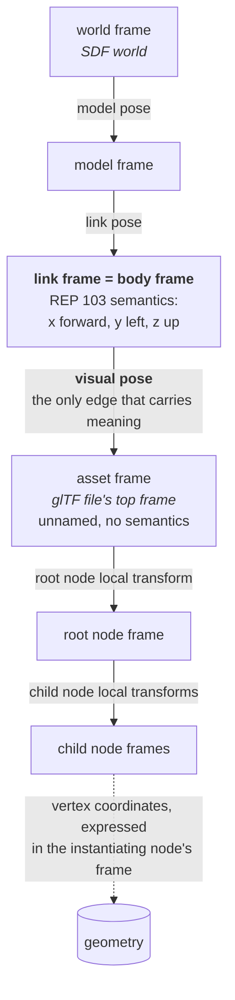
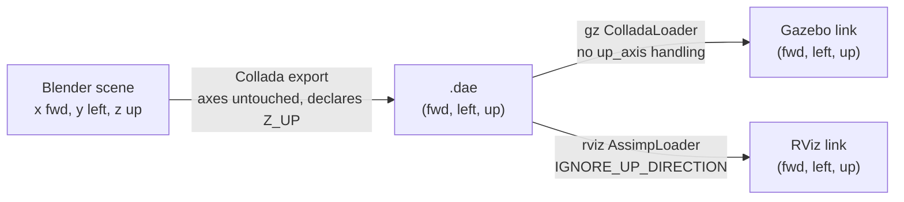
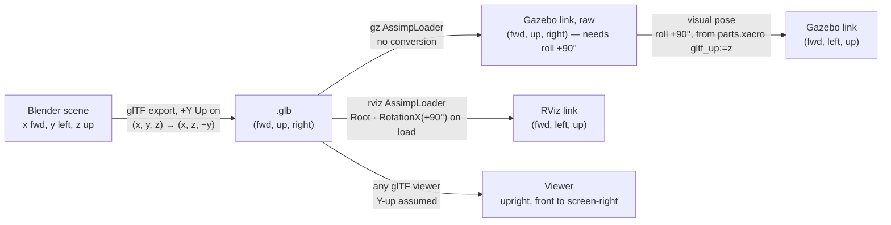
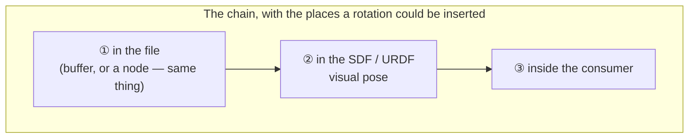

# Coordinate Frames: glTF, Gazebo and ROS 

This is a starting point for a joint agentic workflow.

## Plan: 

### Objectives:  

* Develop materials to explain how coordinates in 3D assets in glTF format are consumed and converted to coordinate frames in Gazebo sim entities.
* The simpest use case, which we may expand, is when the 3D asset is a single visual mesh.   
* Draft a section of src/bluerobotics_models/docs/reference/model-spec.md that provides clear, normative direction on how a 3D author in Blender should arrange coordintes.

### Background and context:

* See discussion in CC history on our old workflow: Collada (single mesh), with single coodinate frame of the mesh.  The coordinate frame of the mesh was in the centroid of the 3D object and followed ROS REP 103 convention.    Those instrucuctions were very simple and easy to implement: 
- Single mesh
- Single coordinate frame orign (that of the mesh)
- Simple rule - REP 103
- Simple verification - check each mesh in Gazebo
How do we refactor that workflow for glTF so our 3D author and developers can work together?  


* This new REP on SDF usage and glTF may have some useful sections which we should use. https://github.com/openrobotics/reps/blob/main/_posts/rep-0158%3A2006.md

* glTF spec Section 3.4
glTF uses a right-handed coordinate system.
glTF defines +Y as up; the front side of a glTF asset faces +Z, the left side of a glTF asset faces +X.


* ROS REP 103
Axis Orientation
In relation to a body the standard is:
x forward
y left
z up

### Actions

* Research on the references above.  
* Research on asset coordinates vs body-frame coordinate
* Draft, below in this document
    * Description of how this works.  Start with summary, step-by-step of collada workflow (old).  Then step-by-step of the 
* After done with first draft, run two critic agents - one the role of the software engineer.  They need to know what they are getting.  They may question why or point ot decisions.  The second critic is the 3D modeler who just wants a clear explanation of how they set it up in Blender
* Revise with critical feedback
* Then read again and look for places to put relevant references, as links; and add any visual that will help - either from the web or make your own illustrations, block diagrams, etc.
* Ask me for any clarification along the way
---

# Coordinate frames across Blender, glTF, Gazebo and RViz, derived from first principles

Everything below is derived from the standards and from the source of the programs that implement them, then checked with assets written for the purpose. The parts library's delivered files and the project's earlier documents are not used as evidence; they are audited against the result in section 14. Section 1 sets out the frames and the transform tree in kinematic terms first, since the standards themselves state everything in the language of axes. Two critics, a software engineer and a 3D modeler, reviewed the first draft; what they changed is recorded in section 16.

Evidence tags, in descending order of authority:

- `[S]` a standard, cited by section
- `[C]` implementation source, quoted, with the version
- `[P]` a probe run on a hand-authored asset, output in `spike/coords/out/probe_results.txt`
- `[O]` an observation only a person with a screen can make; these are the tutorial's job

Versions everything was checked against: gz-common 7.3.0 (`ros-lyrical-gz-common-vendor 0.3.6`), Gazebo Sim 10.5.0, rviz_rendering 15.2.5, assimp 6.0.4, glTF-Blender-IO `main` and Blender 4.2 sources as of this writing.

One convention for describing a wrong orientation, used throughout: an error is named by the correction the visual pose would need, as SDF fixed-axis roll, pitch, yaw. "Needs roll +90°" means the part is displayed such that `<pose>0 0 0 1.5708 0 0</pose>` would fix it.

## 1. The frames, as a kinematic chain

This document's sources talk about "axes" and "up" and "forward". That is the language of a file format. A robotics engineer thinks in frames, poses and a transform tree, and almost everything below is easier to read once the chain has been laid out that way. So that is this section, and nothing in it is specific to glTF's conventions; it is the scaffolding the rest hangs on.

### 1.1 Notation

Write `T_a_b` for the transform that takes a point's coordinates in frame `b` to its coordinates in frame `a`, so that `p_a = T_a_b · p_b` and a chain composes right to left, `T_a_c = T_a_b · T_b_c`. Every transform in this document is static. There are no joints, no time and no velocities anywhere in the problem: it is a tree of fixed transforms, the equivalent of a tf tree published entirely by static transform publishers.

### 1.2 What carries a frame in glTF, and what does not

glTF's scene graph is a transform tree in exactly the tf sense, and the intuition transfers. Three points about it are worth making precisely, because the first is where the intuition usually goes wrong.

**Frames live on nodes, and only on nodes.** A node's local transform is `T_parent_node`, given either as a `matrix` or as `translation`, `rotation` and `scale`. The specification's composition rule is a tf lookup written out `[S]`: "the global transformation matrix of a node is the product of the global transformation matrix of its parent node and its own local transformation matrix. When the node has no parent node, its global transformation matrix is identical to its local transformation matrix."

**A mesh is not a frame, and neither is a primitive.** A mesh carries no transform of its own `[S]`; its vertex coordinates are expressed in the frame of whichever node instantiates it. That is why one mesh may be instantiated by several nodes at several different places — geometry is frame-relative data, not a frame. So there is no "mesh frame" in the tree, and a part split into several primitives to carry several materials is still one frame's worth of geometry: primitives cannot fragment a frame, because there is nowhere on a primitive to put a transform.

**A scene's space is the file's top frame.** A scene is a list of root nodes, and the space their local transforms are expressed in is what this note calls the asset frame. glTF never names it, and it is the closest thing in the format to a world frame — but only in a structural sense, because glTF has no world: no ground, no gravity, no environment, nothing for that frame to be relative to.

Where the analogy stops:

| | tf | glTF |
|---|---|---|
| What an edge is | a rigid transform, SE(3) | translation, rotation **and scale**, so an edge is an affine similarity and need not be rigid |
| What identifies a frame | the `frame_id` string; the tree is assembled by name | the array index in `node.children`; names are optional, non-unique decoration |
| Time | every transform is stamped and interpolated | none; one static snapshot |

The scale row is the one that catches a robotics engineer out. A glTF node edge can rescale its subtree, which no tf transform can do, so "frame" is doing slightly less work here than in tf.

### 1.3 The chain for one of our parts



The mesh is attached at the visual frame, so the visual-to-asset edge is the identity and the visual pose is the whole of `T_link_asset`. In SDF that pose is, by the specification's own words, "expressed in the frame of the parent XML element" `[S]`, the link; in URDF it is the visual `<origin>`. A vertex therefore reaches the body frame as

`p_link = T_link_asset · T_asset_rootnode · … · p_node`

with every factor to the right of `T_link_asset` coming out of the file, and `T_link_asset` coming from the SDF or URDF that mounts it.

### 1.4 Only one edge in that chain carries meaning

Above the visual pose, every frame is named and the names are contracts. `base_link` means something, and REP 103 assigns semantics to its axes: x is the direction the body travels, not merely the first axis.

Below the visual pose, nothing means anything. No glTF frame has semantics. The format has no property that says "this node is the body frame", or "this axis is forward", or "the origin belongs at the mounting face". The origin of a glTF frame is wherever the numbers evaluate to zero, and nothing in the file records where it was meant to be. This is the answer to the question the directive asks — where asset coordinates end and body-frame coordinates begin — and the answer is sharper than it first looks: a glTF file has no body frame, and cannot have one. It supplies a frame; the meaning of that frame is asserted from outside.

So the entire coordinate problem is one edge, `T_link_asset`. That is where somebody declares what the asset's axes mean in the body frame. It is the only place the declaration can live, because the file has no vocabulary for it and the consumer has no knowledge of it. And no validator can check it, which is why the rule has to be written down in a document like this one rather than enforced by a tool.

Read this way, glTF's "+Y is up" and "the front faces +Z" are not facts about geometry at all. They are a recommended value for that one edge, stated in prose instead of in data. Section 3 takes them at face value and does the arithmetic.

### 1.5 The two consumers disagree about where the correction edge goes

Both consumers need the same correction — a rotation of +90° about X, taking a Y-up asset frame to a Z-up link frame — and they attach it to different links of the chain.

Gazebo inserts it **above** the root node, as the visual pose, leaving the file's own transforms untouched:

`p_link = Rx(90) · T_asset_rootnode · p_node`

RViz inserts it **below** the root node, by post-multiplying the root node's own transform `[C]`, and its visual origin stays identity:

`p_link = T_asset_rootnode · Rx(90) · p_node`

The two agree exactly when `T_asset_rootnode` commutes with `Rx(90)`: when the root node is the identity, a pure scale, or a rotation about X alone. Any other root transform, a translation included, places the geometry in two different spots. That is the whole of the hazard that section 4.4 derives from the source and section 5 measures, stated kinematically: the same correction frame, attached at a different point in the tree. It is also the reason the root node has to be the identity, which is a rule about tree shape rather than about axes.

### 1.6 Vocabulary

| Kinematics | glTF | This note |
|---|---|---|
| world frame | nothing; the format has no world | the SDF world, outside the file |
| body frame | nothing; not expressible in the format | the link frame, with REP 103 semantics |
| the frame a file's contents are expressed in | the scene's implicit space | asset frame |
| a frame in the transform tree | a node | node frame |
| geometry expressed in a frame | a mesh and its primitives | the vertices |
| fixed joint, static transform | a node's `matrix` or TRS properties | node transform |
| a frame's name | `node.name`: optional, non-unique, and not how the tree is assembled | see section 4.2 on submesh naming |

## 2. The answer in one page

In the terms of section 1: a glTF file supplies an asset frame and says nothing about what it means. The standard fixes which way is up in that space and says, without a requirement keyword, which way an asset's front faces. ROS, through REP 103, fixes what a body frame means: x forward, y left, z up. Nothing connects the two. The connection has to be made by someone, somewhere in the chain from Blender to the screen, and the whole difficulty is that the two programs that consume our files make it in different places.

- Blender is Z-up, like ROS. A part modeled x forward, y left, z up in Blender is in the body frame while it is in Blender.
- Blender's glTF exporter rewrites every position as `(x, y, z) → (x, z, -y)` to produce the Y-up file the standard describes. `[C]` The file therefore has forward on +X, up on +Y, and the part's right-hand side on +Z.
- Gazebo reads that file exactly as written, making the asset frame the link frame. It performs no up-axis conversion of any kind. `[C][P]` Left alone, the part needs roll +90°: its top points along y, its left side at the ground.
- RViz reads the same file and rotates it +90° about X on load, taking glTF Y-up to ROS Z-up. `[C]` Left alone, the part appears correctly.
- So roll +90° has to be applied on the Gazebo side and not on the RViz side. In this project that is done in `parts.xacro` by expanding the URDF with `gltf_up:=z` for Gazebo only.

That is the mechanism. Four further facts shape what a modeler may and may not do:

- Node transforms inside the file are honored by both consumers and baked into the vertices. `[C][P]` A rotation left on an object in Blender becomes a rotation node and is faithfully applied — with one exception: installed gz-common 7.3.0 drops the root node's rotation for a `.gltf` file and keeps it for a `.glb`, because of a case bug. `[C][P]`
- A transform on the root node is composed differently by the two consumers, because RViz inserts its +90° *inside* the root node while Gazebo's correction is applied outside the whole file. A root translation of 0.5 m along file Y ends up 0.5 m up in Gazebo and 0.5 m to the left in RViz. `[C][P]` The root node has to be identity.
- The glTF sentence "the front side of a glTF asset faces +Z" is a convention no consumer implements and no validator checks, because nothing in a file marks a front. Our files face +X, and whether to change that is an open decision (section 9).
- The old Collada workflow needed none of this because both consumers ignore a Collada file's `<up_axis>` declaration and read its geometry raw. `[C][P]` A Z-up Collada file was in the body frame from Blender to screen. That is the simplicity glTF broke.

## 3. Three frames, from the standards

| Frame | Up | Forward | Left | Handedness | Source |
|---|---|---|---|---|---|
| ROS body frame | +z | +x | +y | right | REP 103, "Axis Orientation": "x forward, y left, z up" `[S]` |
| Blender world | +Z | none defined; the viewport's *Front* view looks along +Y at the −Y face | none defined | right | Blender's own convention; the exporter's swizzle below is what proves it Z-up `[C]` |
| glTF | +Y | +Z | +X | right | glTF 2.0 §3.4 `[S]` |

Blender's "front" is a third convention, neither ROS's +X nor glTF's +Z, and it is the one a modeler looks at all day. Section 10 deals with it.

The glTF text, in full, from §3.4 Coordinate System and Units `[S]`:

> glTF uses a right-handed coordinate system. glTF defines +Y as up; the front side of a glTF asset faces +Z, the left side of a glTF asset faces +X. The units for all linear distances are meters. All angles are in radians.

Two things about that paragraph matter later. It uses no requirement keyword, so nothing in it is a MUST in the BCP 14 sense. And it speaks of "a glTF asset" as a whole: it does not say what "front" means for a mesh, a node, or a part with no obvious front, and there is no property anywhere in the format that records one. The up axis, by contrast, is something every exporter and every viewer acts on, so it is a convention with teeth even though it is stated in the same voice.

REP 103 `[S]` states the body frame and the units (meters, radians) and requires right-handedness. Its rotation section defines "fixed axis roll, pitch, yaw about X, Y, Z axes respectively", which is the convention SDF's `<pose>` and URDF's `<origin rpy>` use.

REP 158 `[S]`, a draft, is a USD document with glTF as its export target. Its Z-up rule applies to the USD stage, not to a glTF file, so it does not bear on what a `.glb` contains. Two of its rules do transfer, both stated of the source asset: "Assets must follow the strict ROS Right-Handed convention: X-forward, Y-left, Z-up", and "Assets must not rely on root-node rotations (e.g., `xformOp:rotateX = -90`) to align geometry. Points and normals should be transform-applied (frozen) to Z-up at the source level."

### 3.1 The algebra

All three frames are right-handed, so every mapping between them is a proper rotation, and each can be written as one or two of the fixed-axis rotations REP 103 names. Writing a body-frame vector as (forward, left, up) and a file-frame vector as (X, Y, Z):

| The file was produced by | File (X, Y, Z) holds | Rotation that returns it to the body frame |
|---|---|---|
| A. Blender's default export of a body-frame model | (forward, up, right) | roll +90° |
| B. Authoring to the glTF sentence, +Z front and +X left | (left, up, forward) | roll +90°, then yaw +90° |
| C. Exporting with the Y-up conversion off | (forward, left, up) | none |

Roll +90° about x maps (X, Y, Z) to (X, −Z, Y). Applied to A that gives (forward, −right, up) = (forward, left, up), the body frame. Applied to B it gives (left, −forward, up), which is still wrong by a yaw; yaw +90° maps (a, b, c) to (−b, a, c), giving (forward, left, up). SDF and URDF compose fixed-axis roll, pitch, yaw as Rz(yaw)·Ry(pitch)·Rx(roll), so roll is applied first and A is written `1.5708 0 0`, B `1.5708 0 1.5708`.

C is what the vertex data looks like before any exporter touches it. It is not a glTF convention; it is the body frame stored in a glTF container.

## 4. What each implementation does, from source

### 4.1 Gazebo: routing by extension

`gz-common` `MeshManager::Load` lowercases the extension and picks a loader `[C]`, gz-common 7.3.0 `MeshManager.cc`:

```cpp
if (extension == "stl" || extension == "stlb" || extension == "stla")
  loader = &this->dataPtr->stlLoader;
else if (extension == "dae")
  loader = &this->dataPtr->colladaLoader;
else if (extension == "obj")
  loader = &this->dataPtr->objLoader;
else if (extension == "gltf" || extension == "glb" || extension == "fbx")
  loader = &this->dataPtr->assimpLoader;
```

`GZ_MESH_FORCE_ASSIMP=true` sends everything through assimp instead. Collada goes to Gazebo's own loader by default.

### 4.2 Gazebo: the glTF path applies no axis conversion

`AssimpLoader::Load` `[C]`, gz-common 7.3.0 `AssimpLoader.cc` lines 846–852, computes the root transform like this:

```cpp
std::transform(extension.begin(), extension.end(),
    extension.begin(), ::tolower);

// compute assimp root node transform
bool useIdentityRotation = (extension != "glb" && extension != "glTF");
auto transform = this->dataPtr->UpdatedRootNodeTransform(scene,
  useIdentityRotation);
```

and `UpdatedRootNodeTransform` (lines 955–976):

```cpp
// Some assets apear to be rotated by 90 degrees as documented here
// https://github.com/assimp/assimp/issues/849.
auto transform = _scene->mRootNode->mTransformation;
if (_useIdentityRotation)
{
  // drop rotation, but keep scaling and position
  aiVector3D rootScaling, rootAxis, rootPos;
  float angle;
  transform.Decompose(rootScaling, rootAxis, angle, rootPos);
  transform = aiMatrix4x4(rootScaling, aiQuaternion(), rootPos);
}
// for glTF / glb meshes, it was found that the transform is needed to
// produce a result that is consistent with other engines / glTF viewers.
else
{
  transform = _scene->mRootNode->mTransformation;
}
```

Read it twice. There is no rotation being *added* anywhere. For glTF the file's own root transform is kept; for every other format its rotation part is thrown away, and its translation and scale are kept in both branches. Then `RecursiveCreate` walks the node tree multiplying each node's transform onto its parent's (`nodeTrans = _transform * nodeTrans;`, line 302) and applies the product to every vertex (`vertex = _transform * vertex;`, line 766). So the vertices Gazebo ends up with are the file's buffer values, composed through the file's own nodes, and nothing else. Each submesh is named from the node that carries it (`auto nodeName = ToString(_node->mName); ... subMesh.SetName(nodeName);`, lines 249–251), never from the mesh or the material.

What "root node" means here depends on assimp. Its glTF2 importer `[C]`, `glTF2Importer.cpp` line 1327, hoists a single scene root into `mRootNode` with its transform intact, and only invents an identity `ROOT` when the scene has zero or several:

```cpp
if (numRootNodes == 1) { // a single root node: use it
    mScene->mRootNode = ImportNode(r, rootNodes[0]);
} else if (numRootNodes > 1) { // more than one root node: create a fake root
    aiNode *root = mScene->mRootNode = new aiNode("ROOT");
```

So for the one-object files this project delivers, the glTF root node *is* assimp's root node, and everything said about `mRootNode` applies to it directly.

The case bug: the extension has been lowercased, so it can never equal `"glTF"`. A single-root `.gltf` file takes the `useIdentityRotation` branch and loses its root rotation; a `.glb` keeps it. A file with several top-level nodes is unaffected, because assimp's invented root is identity and the real rotations sit one level down. Fixed in gz-common 7.3.1, where the literal reads `"gltf"`. Confirmed by probe in section 5.

### 4.3 Gazebo: the Collada path ignores `<up_axis>`

Gazebo's own `ColladaLoader.cc` `[C]` reads `<asset><unit meter="…">` (line 717) and scales by it, and contains no handling of `<up_axis>` at all — the string does not appear in the file. Geometry is consumed in the axes it was written in.

If Collada is forced through assimp instead, assimp's importer does honor the declaration `[C]`, `AssetLib/Collada/ColladaLoader.cpp` lines 196–202:

```cpp
} else if (parser.mUpDirection == ColladaParser::UP_Z) {
    pScene->mRootNode->mTransformation *= aiMatrix4x4(
            1, 0, 0, 0,
            0, 0, 1, 0,
            0, -1, 0, 0,
            0, 0, 0, 1);
}
```

It puts a −90° X rotation on the root node. Gazebo's loader does not set `AI_CONFIG_IMPORT_COLLADA_IGNORE_UP_DIRECTION` (its only importer properties are `PP_FD_REMOVE` and `REMOVE_EMPTY_BONES`, lines 806–808), so that rotation is present, and then dropped by the identity-rotation branch because `.dae` is not `glb` or `gltf`. Either way, Gazebo shows a Collada file's buffer raw. The probe in section 5 shows the identical result for both paths; that it is identical *because* assimp added a rotation Gazebo then removed, rather than never adding one, is inference from the two sources, not something the probe can distinguish.

### 4.4 RViz: rotates glTF inside the root node, ignores Collada up-axis

`rviz_rendering` `mesh_loader_helpers/assimp_loader.cpp` `[C]`, lines 200 and 214–222 on `rolling`:

```cpp
importer_->SetPropertyBool(AI_CONFIG_IMPORT_COLLADA_IGNORE_UP_DIRECTION, true);
...
const std::string ext = std::filesystem::path(name).extension().string();
if (ext == ".gltf" || ext == ".glb" || ext == ".vrm") {
  // Transform mesh from glTF Y-Up space to ROS Z-Up space
  // by applying a 90 degree rotation about the X-axis,
  // effectively going from (x, y, z) to (x, -z, y)
  aiMatrix4x4 transform;
  aiMatrix4x4::RotationX(static_cast<float>(AI_MATH_HALF_PI), transform);
  scene->mRootNode->mTransformation = scene->mRootNode->mTransformation * transform;
}
```

Two decisions in twelve lines. Collada's up-axis is explicitly ignored, so RViz agrees with Gazebo about Collada. glTF is rotated +90° about X, so RViz disagrees with Gazebo about glTF.

Look at where the rotation goes: it is *post-multiplied onto the root node's own transform*. `computeTransformOverSceneGraph` (lines 518–523) then composes parent × child down the tree and `p *= transform` (line 587) applies the product to each vertex, so RViz computes `Root · Rx(90) · Child … · v`. Gazebo computes `Root · Child … · v` and the visual pose then applies `Rx(90)` outside, giving `Rx(90) · Root · Child … · v`. The two agree exactly when `Root` commutes with `Rx(90)`, which is to say when the root node is identity, or a pure scale, or a rotation about X. For a root carrying a translation T, Gazebo shows the geometry at `Rx·T` and RViz at `T`: the same file, 0.5 m up in one and 0.5 m to the left in the other. Child nodes are unaffected, since both compose them on the same side of the correction. Section 1.5 states the same result as a tree: the same correction frame, attached above the root node in one consumer and below it in the other. Confirmed for the Gazebo half by probe in section 5; the RViz half is the tutorial's stage 3.

The installed `librviz_rendering.so` 15.2.5 in the container contains the `.gltf`, `.glb` and `.vrm` extension literals; that shows the comparison is compiled in, and stage 3 of the tutorial is what shows the rotation follows it. The branch was added by ros2/rviz PR 1482, merged to `rolling` on 2025-06-16; the `jazzy` (rviz_rendering 14.1.24) and `kilted` (15.0.15) branches do not contain it `[C]`. The distro floor for these files in RViz is therefore Lyrical.

### 4.5 Blender: the exporter's swizzle

glTF-Blender-IO `[C]`, `__init__.py`, `com/gltf2_blender_math.py` and `exp/primitive_extract.py`:

```python
export_yup: BoolProperty(
    name='+Y Up',
    description='Export using glTF convention, +Y up',
    default=True
)
...
def swizzle_yup_location(loc: Vector) -> Vector:
    return Vector((loc[0], loc[2], -loc[1]))

def swizzle_yup_rotation(rot: Quaternion) -> Quaternion:
    return Quaternion((rot[0], rot[1], rot[3], -rot[2]))

def swizzle_yup_scale(scale: Vector) -> Vector:
    return Vector((scale[0], scale[2], scale[1]))
...
if self.export_settings['gltf_yup']:
    PrimitiveCreator.zup2yup(self.locs)        # positions,  line 1219
...
    PrimitiveCreator.zup2yup(self.normals)     # normals,    line 1558
```

With the default `+Y Up` checked, node translations, rotations and scales go through the `swizzle_yup_*` functions and vertex positions, normals and tangents through `zup2yup`, which is the same `(x, y, z) → (x, z, -y)`. Unchecked, the Blender axes are written as they are — convention C above. The checkbox lives in the export dialog's Transform panel.

Blender's Collada exporter, for contrast, writes the Blender axes and declares `<up_axis>Z_UP</up_axis>` `[C]` (Blender 4.2, `io/collada/DocumentExporter.cpp:234`, `asset.setUpAxisType(COLLADASW::Asset::Z_UP)`); since both consumers ignore that declaration, a Collada file from Blender was always in convention C, and convention C is the body frame. That exporter no longer exists: Blender's `main` branch has no `io/collada` module, so the old workflow cannot be reproduced with a current Blender at all.

## 5. The probe: an asset that cannot be misread

`spike/coords/make_markers.py` writes every variant from scratch, with no exporter involved, so there is no question what is in each file. The marker is four box arms authored in the body frame:

```
        +z  0.25 m  blue
         |
         |
  -x ----+--------------------- +x  1.00 m  red
 0.10 m  |\
 grey    | \
         |  +y  0.50 m  green
```

Every arm has a different length and a different color, and there is a stub on −x, so a bounding box alone identifies every axis and its sign, and any mirroring or mis-rotation is unmistakable in a printout or on a screen. In every file the node is named `marker` and the mesh `marker_mesh`, so the two cannot be confused in the output.

| File | What is in it | Isolates |
|---|---|---|
| `marker_yup.glb`, `.gltf` | buffer swizzled `(x, z, -y)`, root node identity | convention A, and the `.gltf`/`.glb` question |
| `marker_zup.glb`, `.gltf` | buffer raw, root node identity | convention C |
| `marker_rotnode.glb`, `.gltf` | buffer raw, root node `rotation` −90° about X | is a node rotation honored, and by whom |
| `marker_roottrans.glb`, `.gltf` | as `marker_yup`, root node `translation` (0, 0.5, 0) | the root-node composition difference of section 4.4 |
| `marker_twonode.glb` | as `marker_yup`, plus a child node `pointer` with its own mesh, translated (0, 0.5, 0) and rotated +90° about Y | node composition below the root, submesh naming |
| `marker_zup_declZ.dae`, `marker_zup_declY.dae` | identical raw buffers, `<up_axis>` `Z_UP` and `Y_UP` | whether the declaration does anything |

`glb_probe` (`spike/glb_probe`, linked against the installed gz-common, extended here to print per-submesh bounds) loads each through `MeshManager` exactly as Gazebo does. Results `[P]`:

| File | Loader bounding box, (X, Y, Z) min → max | Reading |
|---|---|---|
| `marker_yup.glb` | (−0.10, −0.025, −0.50) → (1.00, 0.25, 0.025) | raw; up on +Y, left arm on −Z |
| `marker_yup.gltf` | same | same |
| `marker_zup.glb` | (−0.10, −0.025, −0.025) → (1.00, 0.50, 0.25) | raw; the body frame, unchanged |
| `marker_zup.gltf` | same | same |
| `marker_rotnode.glb` | (−0.10, −0.025, −0.50) → (1.00, 0.25, 0.025) | rotation node honored: equals `marker_yup` |
| `marker_rotnode.gltf` | (−0.10, −0.025, −0.025) → (1.00, 0.50, 0.25) | rotation node dropped: equals `marker_zup` |
| `marker_roottrans.glb` and `.gltf` | (−0.10, 0.475, −0.50) → (1.00, 0.75, 0.025) | root translation applied along file Y, in both containers; the visual pose will then roll it to link z |
| `marker_twonode.glb`, submesh `pointer` | (−0.025, 0.475, −0.30) → (0.025, 0.525, 0.00) | child TRS composed and baked |
| `marker_zup_declZ.dae` | (−0.10, −0.025, −0.025) → (1.00, 0.50, 0.25) | raw |
| `marker_zup_declY.dae` | identical | declaration ignored |
| both `.dae`, `GZ_MESH_FORCE_ASSIMP=true` | identical | raw either way; see section 4.3 for why |

Every row is what section 4 predicts. The two that carry the most weight: `marker_rotnode.gltf` versus `.glb` is the case bug made visible, and the two `.dae` files being identical in the loader is the old workflow's foundation made visible.

Also from the probe: the four primitives of the one-node marker all arrive as submeshes named `marker`, the node, while the mesh is `marker_mesh`; the child arrives as `pointer`. That is the naming line quoted in section 4.2, seen from outside.

## 6. The old workflow, step by step, and why four rules were enough



1. Model in Blender with x forward, y left, z up. The Blender world frame is the body frame.
2. Put the object origin where the link origin should be.
3. Export Collada. The file's axes are Blender's axes.
4. Reference it from `<visual><geometry><mesh>` with no pose.
5. Look at it in Gazebo.

The four rules — one mesh, one origin, REP 103, check it in Gazebo — were sufficient because nothing in the chain transformed anything. The file's frame was the body frame, both consumers read it raw, and the only way to get it wrong was to author it wrong, which one look in Gazebo caught. The rules never mentioned axis conversion because there was none to mention. That was not a property of Collada as a format, which has an `<up_axis>` and a full node hierarchy; it was a property of the two loaders ignoring the declaration and of Blender writing its own axes.

## 7. The glTF workflow, step by step



1. Model in Blender with x forward, y left, z up, as before.
2. Apply all transforms, so the object's location, rotation and scale are identity and the geometry lives in the vertex data.
3. Export glTF Binary with `+Y Up` checked, the default. The exporter rewrites every coordinate. The file is now in convention A: forward +X, up +Y, right +Z.
4. Reference it from the visual. For Gazebo, give the visual a pose of roll +90°. For RViz, give it none.
5. Look at it in both.

Three of the four old rules survive intact. The one that changed is "REP 103": it is still true of the Blender scene and now false of the file, and the file is in a frame nobody chose on purpose. The correction that repairs it is invisible in the file, differs between the two consumers, and lives in a macro argument. "Check it in Gazebo" now checks Gazebo plus the macro, and says nothing about RViz. That is the whole of what got harder.

## 8. Where the correction can live



| Place | Who does it today | What rules it in or out |
|---|---|---|
| ① the file, whether as raw Z-up buffers (convention C) or as a rotation node the consumers bake in | nobody, on purpose; a modeler by accident if a transform is left unapplied | Both consumers compose node transforms into the vertices, so a rotation on a node has exactly the effect of the same rotation in the buffer `[C][P]`; the two encodings are one place. RViz applies its own +90° regardless, so a file corrected here needs roll −90° in RViz, and lies on its side in every glTF viewer and on re-import into Blender. Gazebo alone would be happy. And a root-node rotation adds the hazards of section 4.4: composed on the wrong side of RViz's correction, and dropped for a `.gltf` on gz-common 7.3.0. REP 158 forbids it at the source. `[S]` |
| ② the visual pose | `parts.xacro`, for Gazebo only | Has to differ between consumers, because ③ already differs. Hence the `gltf_up` argument and two expansions of one URDF. Explicit, checkable, and the only place a body-frame statement belongs by section 1.4. |
| ③ the consumer | RViz | Not ours to change. It is the reason ② cannot be one value for both. |

The project's arrangement — ② for Gazebo, ③ for RViz, nothing in the file — is the only one that keeps the file conventional, keeps a viewer honest, and stays clear of the root-node hazards. It costs one xacro argument.

## 9. The open decision: which way does the file face

Section 3.1 gave three conventions. C is ruled out above. Between A and B, stated as evenly as possible:

| | A. forward on +X, what Blender's export of a body-frame model produces | B. forward on +Z, the glTF sentence |
|---|---|---|
| How the modeler authors | in the body frame; nothing deliberate | the Blender scene rotated −90° about Z, so forward is on Blender −Y; one deliberate step every time, with no tool that checks it |
| Gazebo visual pose | roll +90° | roll +90°, yaw +90° |
| RViz / installed URDF origin | none | yaw +90° |
| In a glTF viewer, Fuel thumbnail, or USD import | upright, seen from its left side; the default camera does not face it | upright, facing the camera |
| Meets glTF §3.4 | up axis yes; front sentence no | both |
| REP 158, which is stated of the source asset | the Blender source is X-forward, Z-up, frozen: matches | the Blender source is −Y-forward: departs; the file matches glTF's own convention instead |
| Cost of switching to it | none, it is the status quo | one bake per existing delivery, a yaw about file Y, the same kind of script as `gltf_to_yup.py`; one string in `gltf_visual_rpy`; a non-identity visual origin in the installed URDF |
| What a modeler's mistake looks like | a B-style file arrives: faces starboard in both consumers | an A-style file arrives: faces port in both consumers |

Neither is wrong. Under A the modeler who authors in the body frame gets a correct file without knowing any of this, and the file looks odd only outside the robotics toolchain. Under B the file is right everywhere and the modeler has one thing to get right by hand. This note does not settle it; it is review decision 2, and it stays open.

## 10. For the modeler: what to do in Blender

You do not need to read the rest of this document. Five words you will meet:

- *link* — the rigid piece of the robot your file gets attached to. Your file's axes become its axes.
- *node* — a glTF object. Any transform you leave unapplied in Blender becomes one, and that is what the rules below are about.
- *Gazebo* and *RViz* — the two programs that display your file. They handle orientation differently; that is the engineer's problem, not yours, as long as you follow the rules.
- *port* and *starboard* — the part's own left and right, as if you were aboard it facing forward. "Left" below always means port.

Today the file faces +X, which is simply what you get by modeling forward on +X and pressing export. Ignore the bracketed "under B" remarks unless the team tells you the forward-axis rule has changed.

### 10.1 The rule on one line

Real size in meters, forward on +X, left on +Y, up on +Z, reference point at (0, 0, 0), one object, Ctrl+A → All Transforms, export `.glb` with `+Y Up` on.

### 10.2 The steps

1. Scene Properties → Units: Metric, Unit Scale 1.0. Model at real-world size. The exporter writes Blender units as meters and does not apply the Unit Scale, so with any other setting the numbers you read in the N panel are not the numbers in the file.
2. Model the part with +X forward, +Y toward its port side, +Z up, in Blender's world axes. Blender's *Right* view (numpad 3) then shows the part's front and Blender's *Front* view (numpad 1) shows its starboard side. That is not a typo; it is the whole point of the axis rule. *(Under B: the front faces −Y, so Front view looks at it.)*
3. Which way is forward: the part's documentation says. For a sensor, the direction it senses; for a thruster, the direction it pushes; for a cylinder, its axis on +X. If nothing defines it, ask; do not choose.
4. Position the geometry so the part's reference point sits at Blender's world origin. Which point that is comes from the part's documentation; if it says nothing, ask. Step 6 moves the object origin to the world origin, so this is what fixes where the file's zero is.
5. One object per file. Join everything (select all, Ctrl+J). No empties, no parenting, no collection instances. If a part genuinely needs separate pieces, ask first. Materials survive a join as material slots on the result. Name the object after the part; that name is what the engineers see.
6. With the object selected, Object → Apply → All Transforms (Ctrl+A → All Transforms). Afterwards the N panel's Item tab must read Location 0, 0, 0, Rotation 0, 0, 0, Scale 1, 1, 1. A file with a leftover transform is rejected on delivery.
7. File → Export → glTF 2.0. Format: glTF Binary (`.glb`). Include → Limit to → Selected Objects if the scene has anything else in it. Transform → `+Y Up`: leave it checked. Do not "fix" the orientation for any particular program.

### 10.3 Check it yourself before sending

Two checks, because each catches what the other cannot.

- In a viewer with a grid and axis gizmo — the three.js editor is one — drop the `.glb` in. In its default camera you are looking at the part's port side: the front points to the right of the screen, the top points up, and the port side faces you. *(Under B: the front faces you.)* If it lies on its side, `+Y Up` was off. If it stands up but faces you or away, step 2 was off. Check the size against the grid, and that the reference point is on the origin.
- File → Import → glTF 2.0 into an empty Blender scene. The object must come in at Location 0, Rotation 0, Scale 1 and look identical to what you exported. A viewer applies node transforms silently, so this is the only check that catches an unapplied transform — the one mistake a file is rejected for.

`spike/coords/out/marker_yup.glb` is a reference: four colored arms, red forward, green port, blue up. Open it in your viewer to see what correct looks like.

### 10.4 Never

- Leave a transform unapplied. It becomes a node, and the file is rejected.
- Export with `+Y Up` off to make one program happy. The others break, and that program is already handled.
- Rotate the model to face +Z because the glTF specification says so, unless decision 2 has gone that way. It would face starboard in every assembly.

### 10.5 Checklist per delivery

- meters, Unit Scale 1.0
- forward +X, port +Y, up +Z; forward defined by the part's documentation
- reference point at (0, 0, 0)
- one object, named after the part
- Ctrl+A → All Transforms; N panel reads 0 / 0 / 1
- `.glb`, `+Y Up` on
- viewer: upright, front to screen-right, size right, origin right
- re-import: no transform on the object

## 11. For the engineer: what you are getting, and what can go wrong

- A delivered `.glb` in convention A. Its axes go straight onto the link axes in Gazebo; RViz rotates it itself. The roll +90° lives in `parts.xacro` behind `gltf_up`, and only the Gazebo expansion sets it.
- `gltf_up:=z` is passed wherever a URDF is expanded for Gazebo, and those sites have to stay in step: `blueboat_gazebo/CMakeLists.txt:55`, `bluerov2_gazebo/CMakeLists.txt:72`, both `*_gazebo/scripts/configure_vehicle.py:79`, and `bluerobotics_parts/scripts/parts_check_world.py:94`. The `*_description/launch/display.launch.xml` files default it to `y`. The classic mistake is spawning the ROS-flavored `robot_description` into Gazebo with `ros_gz_sim create -topic`; every glTF visual then needs roll +90°.
- `part_visual` is the only macro that applies `gltf_visual_rpy`, and its `xyz` argument is in the part frame, not rolled. Collision geometry is SDF primitives today, so no glTF collision mesh exists to need the roll; if decision 1 changes that, the collision macro needs the same treatment.
- The root node must be identity. A root rotation is honored by Gazebo for `.glb` and dropped for `.gltf` on the installed 7.3.0 (fixed in 7.3.1). A root translation is applied by both consumers but on opposite sides of RViz's +90°, so it lands in different places (section 4.4). A root scale is applied by both, on the same side, and is merely a modeler's error. Below the root, node transforms are honored and baked in `[P]`.
- Submeshes are named after glTF nodes, never meshes or materials `[C][P]`. Several primitives under one node share a name, and `<submesh><name>` in SDF cannot tell them apart.
- RViz's glTF rotation exists on Lyrical (rviz_rendering 15.2.x) and Rolling from June 2025; Jazzy and Kilted do not have it, and on those every glTF part needs roll +90° in RViz while the Gazebo path is unchanged. There is no URDF that is right for both. State Lyrical as the floor.
- Collada is on borrowed time in Gazebo and already gone from Blender's development branch, but if you meet one: both consumers ignore its `<up_axis>`, so a Z-up Collada from Blender is in the body frame and needs no pose. That is not a reason to keep using it.
- Acceptance, without a GPU: run `glb_probe` on the file and check that there is one root node named after the part; that the file's JSON puts no `translation`, `rotation`, `scale` or `matrix` on it; that the bounding box has the part's length on X, height on Y and width on Z, at the published dimensions; and that the container is `.glb`. `glb_probe` lives in `spike/`, which this workspace treats as disposable; if it becomes the acceptance tool it needs a home.

## 12. Tutorial: see it for yourself

Each stage names its role: *modeler* for Blender work, *engineer* for the simulation side, *analysis* for reading files back. Stages 1 and 4's Blender halves need Blender, which is not installed here or in the container; the rest runs in drydock and a browser. All generated files are in `~/maritime_ws/spike/coords/out/`; regenerate with `python3 ~/maritime_ws/spike/coords/make_markers.py ~/maritime_ws/spike/coords/out`.

### Stage 0 — tools

| Tool | What it tells you | Where |
|---|---|---|
| Blender | what the exporter does | your machine |
| a browser glTF viewer with a grid and axis gizmo, for example the three.js editor | what the file says, under the Y-up assumption every viewer makes; not what Gazebo does with it | browser, drag and drop the `.glb` |
| `glb_probe` | what Gazebo's loader built, as numbers | drydock, `~/maritime_ws/spike/glb_probe/build/glb_probe FILE` |
| `gz sim` | what Gazebo shows | drydock, X forwarded |
| `rviz2` | what RViz shows | drydock, X forwarded |

### Stage 1 — author the marker in Blender (modeler)

Build the marker from section 5, so that the numbers you type are the numbers that should come out.

1. New scene. Scene Properties → Units: Metric, Unit Scale 1.0. Delete the default cube.
2. Add → Mesh → Cube, then in the N panel set Dimensions X 1.0, Y 0.05, Z 0.05 and Location X 0.5. Name it `arm_pos_x`. Give it a red material. Setting Dimensions changes the object's Scale, so the N panel shows non-unit scale for now; step 4 fixes that.
3. Repeat: `arm_pos_y`, dimensions 0.05 × 0.5 × 0.05, location Y 0.25, green. `arm_pos_z`, dimensions 0.05 × 0.05 × 0.25, location Z 0.125, blue. `arm_neg_x`, dimensions 0.1 × 0.05 × 0.05, location X −0.05, grey.
4. Shift+C to put the 3D cursor at the world origin. Select all four, Object → Join (Ctrl+J), rename the result `marker`, Object → Set Origin → Origin to 3D Cursor, then Object → Apply → All Transforms. The N panel must now read location 0, rotation 0, scale 1. The four materials survive as slots.
5. Export as `marker_blender_yup.glb`: glTF Binary, Transform → `+Y Up` checked, Include → Limit to → Selected Objects, Data → Mesh → Apply Modifiers on.
6. Export again as `marker_blender_zup.glb`, identical except `+Y Up` unchecked.
7. Put both in `~/maritime_ws/spike/coords/out/`.

### Stage 2 — read what the exporter did (analysis)

I read the buffer and node data out of both files and print the bounding box and the node transforms, next to `marker_yup.glb` and `marker_zup.glb` from the generator. Expected: `marker_blender_yup.glb` matches `marker_yup.glb`, (−0.10, −0.025, −0.50) → (1.00, 0.25, 0.025), and the Z-up export matches `marker_zup.glb`. Both should have one root node with no transform.

A surprise here and its meaning: a root node with a transform means step 4's Apply did not happen. A bounding box with the 0.5 m arm on +Z instead of −Z means a handedness flip somewhere, which would be a real finding.

### Stage 3 — watch three consumers disagree (engineer)

All three use `marker_yup.glb` and nothing else. No corrections anywhere.

Browser: drop the file into the viewer. Expect it upright — blue up — with the red arm to the right of the screen and the green arm pointing away from you, into the screen, along −Z.

Gazebo, uncorrected:

```bash
~/maritime_ws/tools/drydock/drydock join maritime bash -lc 'gz sim -r ~/maritime_ws/spike/coords/out/world_marker.sdf'
```

The model sits 0.6 m up so the long arm clears the ground. Expect the red arm along +x, the *blue* arm along +y, and the green arm pointing straight down. That is convention A read raw: file Y on link y, file −Z on link −z. The part needs roll +90°.

Gazebo, corrected — the same world with `<pose>0 0 0 1.5708 0 0</pose>` on the visual:

```bash
~/maritime_ws/tools/drydock/drydock join maritime bash -lc 'gz sim -r ~/maritime_ws/spike/coords/out/world_marker_rolled.sdf'
```

Expect red +x, green +y, blue +z. The body frame.

RViz, with the URDF whose visual origin is identity. The publisher is started in the background and stopped when RViz closes:

```bash
~/maritime_ws/tools/drydock/drydock join maritime bash -lc 'ros2 run robot_state_publisher robot_state_publisher --ros-args -p robot_description:="$(cat ~/maritime_ws/spike/coords/out/marker.urdf)" & RSP=$!; sleep 1; rviz2; kill $RSP'
```

Add a RobotModel display, set Fixed Frame to `base_link`. Expect red +x, green +y, blue +z — the same as corrected Gazebo, from a file with no correction. That is RViz's own +90° at work.

Then the root-node case. `marker_roottrans.glb` is the same marker with a translation of (0, 0.5, 0) on its root node. Run `world_roottrans_rolled.sdf` in Gazebo and `marker_roottrans.urdf` in RViz the same way. Expect the marker 0.5 m *above* the link origin in Gazebo and 0.5 m to the *left* of it in RViz: the same file, in two places, which is section 4.4 on screen.

Record what you see as rows: viewer, uncorrected Gazebo, corrected Gazebo, RViz, and the two root-translation runs. If uncorrected Gazebo and RViz agree, one of the loaders has changed and section 4 needs re-reading.

### Stage 4 — more than one mesh (modeler, then analysis)

`marker_twonode.glb` adds a child node `pointer`, an orange 0.3 m bar, translated 0.5 m up the file's Y and rotated to point along the file's −Z. Under RViz's rotation and under corrected Gazebo, expect it 0.5 m above the marker's origin, pointing along +y, to port. Under uncorrected Gazebo, expect it 0.5 m along +y, pointing down.

Then the Blender version. This is a demonstration of what a hierarchy does, not a delivery pattern; section 10 says one object per file.

1. In stage 1's scene, Add → Mesh → Cube, N panel Dimensions 0.3 × 0.05 × 0.05, name it `pointer`. Ctrl+A → Scale, and only Scale. In Edit mode select all and move the mesh +0.15 along X (G, X, 0.15) so the bar runs from the object origin to +0.3 on its own X.
2. Select `pointer`, then shift-select `marker`, Ctrl+P → Object. In `pointer`'s N panel set Location (0, 0, 0.5) and Rotation Z +90°. Leave both unapplied on purpose.
3. Select both objects and export `marker_blender_twonode.glb` with the stage 1 settings.

I read it back. Expected: the child's translation swizzled to (0, 0.5, 0) and its rotation to +90° about the file's Y, so the file agrees with the generated one, and `glb_probe` reports a submesh `pointer` at (−0.025, 0.475, −0.30) → (0.025, 0.525, 0.00). This shows that a hierarchy authored in Blender arrives consistent, and it also shows the price: the pointer's placement is now a node transform, honored by both consumers but invisible in the vertex data, and two files with different content give the same picture.

### Stage 5 — write down the rule that survived

After stages 1 to 4 you have seen every claim in section 2 with your own eyes. The rule a second modeler could follow without asking is section 10, and the engineer's side is section 11. If anything you saw contradicts them, that is the finding, and it goes in section 14 next to the others.

## 13. References

- glTF 2.0 Specification, §3.4 Coordinate System and Units and §3.5 Scenes, Nodes: https://registry.khronos.org/glTF/specs/2.0/glTF-2.0.html#coordinate-system-and-units — the local annotated copy is `tools/glTF` on branch `bsb/notes`, sidebars `honu-coordinate-system` and `honu-node-transforms`
- REP 103, Standard Units of Measure and Coordinate Conventions: https://www.ros.org/reps/rep-0103.html
- REP 158 (draft), OpenUSD Conventions for Simulation Asset Interoperability: https://github.com/openrobotics/reps/blob/main/_posts/rep-0158%3A2006.md
- SDFormat `<pose>`: http://sdformat.org/spec?elem=pose and the pose frame semantics tutorial it links
- gz-common 7.3.0 `AssimpLoader.cc`, `MeshManager.cc`, `ColladaLoader.cc`: https://github.com/gazebosim/gz-common/tree/gz-common7_7.3.0/graphics/src; the `.gltf` fix is in tag `gz-common7_7.3.1`
- rviz_rendering `assimp_loader.cpp`: https://github.com/ros2/rviz/blob/rolling/rviz_rendering/src/rviz_rendering/mesh_loader_helpers/assimp_loader.cpp, added by https://github.com/ros2/rviz/pull/1482
- assimp `glTF2Importer.cpp` and `Collada/ColladaLoader.cpp`: https://github.com/assimp/assimp/tree/master/code/AssetLib
- glTF-Blender-IO `com/gltf2_blender_math.py`, `exp/primitive_extract.py`, `__init__.py`: https://github.com/KhronosGroup/glTF-Blender-IO/tree/main/addons/io_scene_gltf2
- Blender 4.2 `io/collada/DocumentExporter.cpp`: https://github.com/blender/blender/blob/v4.2.0/source/blender/io/collada/DocumentExporter.cpp
- The probe assets and results: `~/maritime_ws/spike/coords/`

## 14. Audit of what the project currently says

Against sections 1 to 5. "Mechanism" means the description of who rotates what.

| Where | Statement | Verdict |
|---|---|---|
| `docs/design/parts.md` rule 2 | "Origin at the mesh centroid, x forward, y left, z up (REP 103)" | True of the Blender scene, false of the file, and does not say which it means. A modeler holding a Y-up export reads it as a contradiction. Should say both: author in the body frame; the file therefore has forward on +X and up on +Y. |
| `docs/design/parts.md` rule 3 | "The `.glb` must be Y-up, as the glTF specification requires ... A Z-up file shows correctly in Gazebo but rolled 90 degrees in RViz" | Mechanism correct `[C][P]`. "Requires" overstates: §3.4 has no keyword. The reason is that every consumer assumes it. |
| `parts.xacro` comment | "glTF meshes are Y-up by specification and the delivered .glb files conform. RViz and other ROS tools rotate them to Z-up on load; Gazebo does not" | Mechanism correct `[C]`. "Conform" can only mean the up axis; the front sentence is a separate question the comment does not address. |
| `model-spec.md` §5.2 | "Every consumer converts on the assumption that glTF is Y-up. RViz rotates a glTF mesh as it loads, and the part macro applies the matching rotation for Gazebo." | The second sentence is right and the first is wrong: Gazebo does not convert; the macro does. That is the exact confusion this note exists to remove. |
| `model-spec.md` §5.3 | "+Z ... stated without a normative keyword" | Half right. Neither the up axis nor the front sentence has a keyword. The difference is that every implementation acts on the first and none can act on the second. |
| `model-spec.md` §5.5 | root node MUST NOT carry a rotation, "because `gltf_to_yup.py` refuses"; "A `translation` on the root node is permitted and is applied by both consumers." | The rotation rule is right and its reason too weak: the loader-level reasons are the `.gltf` case bug and RViz's root post-multiply, and the standards-level reason is REP 158. The translation permission is unsafe: applied by both, yes, but on opposite sides of RViz's correction, so the part lands in two different places (section 4.4, `[C][P]`). |
| `model-spec.md` §6.3, §3 | primitive-to-submesh mapping, and the proposal to rule submesh selection out | Added 2026-09-16 in response to this note. One submesh per primitive, named after the node; `SubMeshByName` returns the first match and stops, so primitives sharing a node cannot be selected apart (gz-common PR 659, open). Verified `[C][P]`: `marker_yup.glb` is one node, one mesh, four primitives and probes as four submeshes named `marker`. |
| `gltf_to_yup.py` docstring | bakes `(x, y, z) → (x, z, −y)` | Exactly Blender's swizzle `[C]`. Correct. |
| `asset-spec.md` (superseded) | "Author to the glTF spec: +Y up, +Z forward" | Convention B. With the current roll-only macro a B file faces starboard in both consumers. Not wrong as a convention; wrong for this pipeline as it stands. |
| `docs/how-to/faq.md` | "rolled 90 degrees in RViz but fine in Gazebo → run `gltf_to_yup.py`" | Correct diagnosis of a convention-C file `[P]`. |
| `docs/design/gazebo-composition.md` | Y-up by specification, RViz rotates, Gazebo does not | Mechanism correct. |
| `VISUAL_ASSET_PIPELINE_REVIEW.md` §1.6 | the full chain, `(x, z, −y)`, `gltf_up:=z`, RViz identical rotation | Matches the derivation throughout, with one slip: a +Z-front file under the current macro "faces left in every assembly" — its front lands on −y, which is starboard. |
| `VISUAL_ASSET_PIPELINE_REVIEW.md` §1.2, §1.5, §1.9 | the case bug; RViz's `RotationX`; one shared space per file, no origin concept | All confirmed here `[C][P][S]`. §1.5's "identical rotation" is identical in angle but not in placement — RViz's is inside the root node — which §1.9's "a translation on the root node is applied by both consumers" then misses. |

## 15. Drafted replacement text for `model-spec.md` §5

Explanation only. No new requirement keywords; both `Undecided` blocks stay. 5.1 and 5.4 unchanged and omitted here. One sentence in the current 5.5 — the permission for a root translation — is contradicted by section 4.4 and is flagged rather than changed, since changing it is a spec decision.

> ### 5.2 Up axis
>
> The model MUST be Y-up, as glTF specifies.
>
> **Implementation Note.** glTF states its up axis without a requirement keyword, but every exporter and every viewer acts on it, so it is the one convention in §3.4 with teeth. The two consumers of this project's files act on it differently. RViz rotates a glTF mesh +90 degrees about X as it loads. Gazebo performs no conversion at all and presents the file's axes as the link's axes, so the part macro applies that same rotation in the visual pose when expanded for Gazebo. A Z-up file therefore renders correctly in Gazebo without the macro's rotation and rolled in RViz and in every viewer; a Y-up file renders correctly in both once the macro is in play. The derivation and its evidence are in the workspace note `glTF_Gazebo_ROS_Coordinates.md`.
>
> ### 5.3 Forward axis
>
> > **Undecided.** Whether the delivered file faces +X, which is what authoring in the part frame produces and what every current delivery does, or +Z, which is the convention stated in glTF. Tracked as review decision 2.
>
> **Implementation Note.** glTF says "the front side of a glTF asset faces +Z". Like the up-axis sentence it carries no keyword, but unlike it, nothing can act on it: a file has no property that marks a front, so no exporter writes one, no consumer reads one and no validator checks one. Whichever way this is decided, the choice is enforced by people, not tools. The mechanics of each branch: a file facing +X reaches the part frame with one rotation, roll +90 degrees, which the macro already applies for Gazebo and RViz applies itself. A file facing +Z would need roll +90 and yaw +90 for Gazebo and yaw +90 for RViz, so the installed ROS URDF would acquire a non-identity visual origin and every existing delivery would be re-baked. REP 158's "X-forward, Y-left, Z-up" is stated of the source asset, which under +X is the Blender scene as authored and under +Z is not. Until this is decided, modelers SHOULD continue to author in the part frame, which yields a file facing +X, and MUST NOT re-orient a delivery to face +Z without agreement. A file delivered facing +Z under the current macro faces starboard in both consumers.
>
> ### 5.5 Node transforms
>
> The delivered file MUST contain exactly one root node, and that node MUST NOT carry a `rotation` or a `matrix` transform. Transforms MUST be applied in Blender before export.
>
> A `translation` on the root node is permitted and is applied by both consumers. *[Flagged: applied by both, but composed on opposite sides of RViz's own rotation, so a root translation places the part differently in the two consumers. See the note below. Whether to withdraw this permission is for the spec owner.]*
>
> **Implementation Note.** Three independent reasons for an identity root, any one of which would suffice. RViz applies its Y-up correction by post-multiplying the root node's own transform, while Gazebo's correction is applied by the visual pose outside the whole file, so any root transform that does not commute with a rotation about X — a translation, or a rotation about any other axis — places the geometry differently in the two consumers. Gazebo's loader keeps the root node's rotation for a `.glb` and, on gz-common 7.3.0, drops it for a `.gltf` because of a case bug in the extension check, fixed in 7.3.1. And REP 158 requires that assets "not rely on root-node rotations to align geometry" and that points and normals be frozen at the source. Node transforms below the root are honored identically by both consumers and baked into the vertices; whether a part may use them is decision 15.

## 16. Critic record

Two reviews of the first draft, run in parallel, and what each changed.

The software engineer's review found one substantive error and several gaps. The error: the draft said both consumers honor node transforms "exactly" alike and the drafted §5.5 permitted a root translation; reading `assimp_loader.cpp:221` shows RViz post-multiplies its +90° onto the root node, so a root translation is composed on the other side of the correction from Gazebo's and the part shows up in two different places. Section 4.4 now derives this, section 5 probes the Gazebo half (`marker_roottrans`), the tutorial's stage 3 observes both halves, and §5.5's permission is flagged. The gaps, all now filled: the submesh-naming claim was tagged `[P]` but the probe used the same name for node and mesh, so the mesh is now `marker_mesh` and the loader line is quoted; assimp's single-root hoist was misdescribed and is now quoted with the bug's scope narrowed to single-root files; the distro floor (Lyrical; Jazzy and Kilted lack rviz PR 1482) and the gz-common fix release (7.3.1) are named; the `gltf_up` call sites, the `ros_gz_sim create` trap, the un-rolled `xyz`, collision meshes, root scale and an acceptance procedure are in section 11; the "rolled" sign convention is defined once; section 8's option ② was shown to collapse into ① and its wrong reasons replaced with the root-node one; section 9's cost table was leaning on the status quo (re-export is a bake, a URDF origin costs nothing, the REP 158 row misread which asset the REP is stated of, and A's viewer cost was missing) and is rewritten even-handed; stage 3's viewer description had the −Z arm "toward you" when the default camera looks along −Z; the model now sits 0.6 m up so its long arm is visible; the RViz command cleans up its publisher; line references were off by a few lines; and evidence tags that outran the fetched sources (Blender vertex swizzle, assimp Collada, REP 158, Blender Collada) were backed by fetching and quoting them.

The 3D modeler's review found section 10 unusable as delivered and the tutorial's Blender steps partly wrong. Changed: the origin instruction contradicted Apply All Transforms, which moves the object origin to the world origin, so the rule is now to put the reference point at (0, 0, 0); the self-check could not detect an unapplied transform, which every viewer applies silently, so a Blender re-import check was added and the viewer check restated in screen terms with a viewer that has a grid; "one object per file" was assumed and never said; parts with no obvious front had no rule, and "left" was ambiguous, so forward now comes from the part's documentation and left means port; "convention A" and "decision 2" were undefined for a reader starting there; stage 4's instructions would have produced a scaled, centered cube that did not match the reference file, and did not say what to leave unapplied or how to parent and export; stage 3 was labeled "you" but needs ROS tools, so stages are now labeled by role; setting Dimensions in the N panel sets Scale, which is now said; the Right-view instruction read as a typo and is now explained; three menu paths were wrong or incomplete; the reason for Unit Scale 1.0 was missing; and a glossary, a one-line rule, a checklist and a reference `.glb` were added. Not done from that review: a rendered screenshot of a real part with labeled axes, and a `marker.blend` to compare against — both need Blender, which the tutorial's stage 1 will produce.
