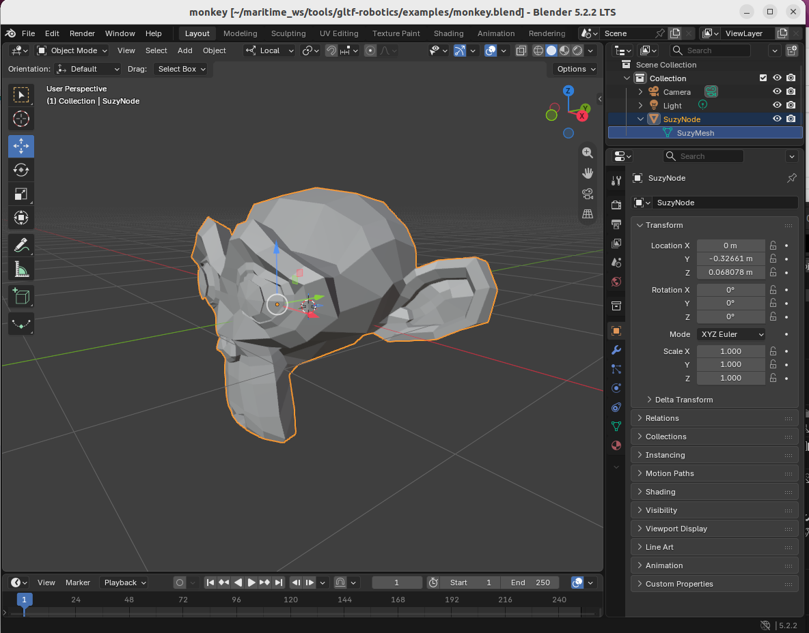
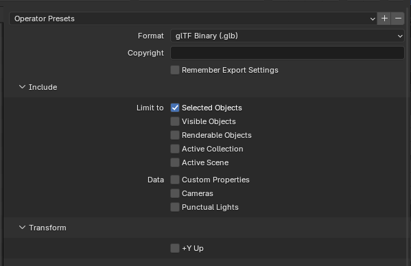
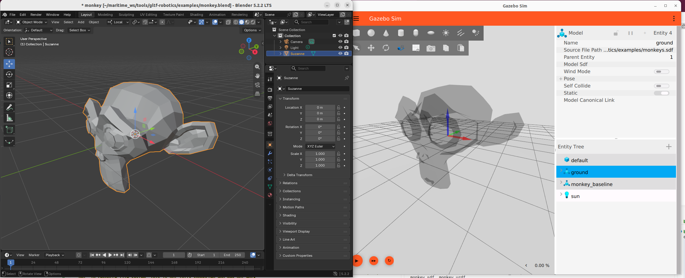
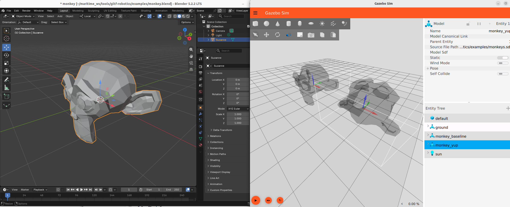
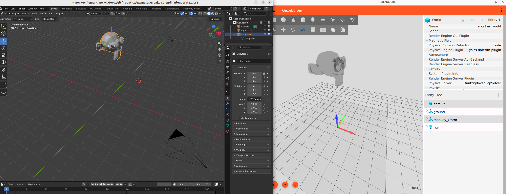
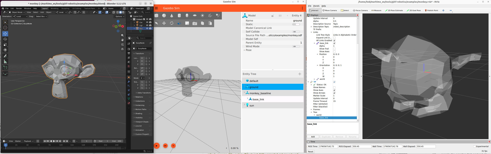

# Minimum viable workflow

This is meant as the simplest possible workflow to demonstrate the workflow and test various assumptions and conventions and to verify the utilities and claims.

## Minimum monkey mesh 

### Create in Blender and export

Add->Mesh->Monkey

* When first created the mesh has no transforms.  Global and local coordinate systems share the same origin location and orientation
    * +x: left
    * +y: back
    * +z: up

Export to glTF 2.0:
There are 110 options in the export widget - many places to cause problems. 

See [the export options reference](../reference/blender-export-options.md) for all 110 with the thirteen that matter called out at the top.

The first one to bite is `use_selection`. The reference prescribes it True, and the first export of this very example was made with nothing selected: the result was a valid 132-byte `.glb` holding one scene and no geometry, with no error and no warning anywhere. Select the object before exporting, and read the file back before going further.


## Baseline

Blender mesh

* Local and global frames coincident
* Blender default for local datum and body coordiante system observed to be
    * +x: left
    * +y: back
    * +z: up
    * local origin (datum) appears to be originally midpoint of the geometry bounding box

Notice the names of the Node and Mesh in the UI, upper right

Note that setting the "origin" in Blender can be ambiguous.  The "center" can be defined as either the "median" or the "bounds".  "Median" is actually the mean (not the median) of the vertex coordinates.  "Bounds" is the bounding box.  Then you can set surface of volume centroid.  More reasons to clearly specify a visual datum as a feature in the mesh!



Export and **DO NOT** select the +Y up option 




Summary tool 

```bash
export GLB="examples/monkey_baseline.glb"
cd ~/maritime_ws/tools/gltf-robotics
PYTHONPATH=src python3 -m gltf_robotics.check.cli $GLB
PYTHONPATH=src python3 -m gltf_robotics.summary $GLB
```

```bash
PYTHONPATH=src python3 -m gltf_robotics.check.cli $GLB
```

See something like this
```
examples/monkey_baseline.glb  (69688 bytes, .glb)
  glTF 2.0   exported by: Khronos glTF Blender I/O v5.2.40
  manifest: none

  scenes: 1 total; the file opens scene [0]
    scene [0] 'Scene' lists 1 root node: [0]
  nodes: 1 total, 1 root, 0 child
    node [0] 'SuzyNode'  root   -> mesh [0]
        translation [0, 0, 0]                  absent, so glTF's default applies
        rotation    [0, 0, 0, 1]               absent, so glTF's default applies (identity)
        scale       [1, 1, 1]                  absent, so glTF's default applies
                    -> node space and scene space coincide
  meshes: 1 instantiated, holding 1 primitive in total
    mesh [0] 'SuzyMesh'  -- 1 primitive
      primitive [0]  NORMAL + POSITION + TEXCOORD_0   material: none
        -- in NODE space, where the node origin is zero
        vertex min/max   [-1.367, -0.8516, -0.9844] -> [1.367, 0.8516, 0.9844]   declared by the accessor
        bbox midpoint    [0, 0, 0]
        vertex mean      [0, -0.314, 0.06139]   over 1966 vertices, split at UV seams, so not the authoring tool's count

  geometry in NODE space, which is also SCENE space here -- no node carries a transform
    bounding box  [-1.367, -0.8516, -0.9844] -> [1.367, 0.8516, 0.9844]
                  union over 1 primitive, unchanged from the vertex min/max above
    extent        [2.734, 1.703, 1.969]   = max - min of that box
    origin at     x 0.50, y 0.50, z 0.50   = (0 - min) / extent, per axis
                  0 = minimum face, 0.5 = midpoint of the bounding box, 1 = maximum face

  materials: none
  ```


Note that both names pass through from Blender: the node name comes from the object, the mesh name from the mesh datablock. They are not equally free, though, and the profile treats them differently.

The **node** name is constrained, by profile 5.5: `<part>`, no Blender numeric suffix, no spaces. It has to be, because it is the only name in the file either consumer reads — Gazebo names every submesh after the node that instantiated the mesh, never after the mesh or the material, so the node name is what appears downstream and what an SDF would have to address.

The **mesh datablock** name is unconstrained, and nothing reads it. Renaming it changes nothing anyone sees. Worth setting anyway so a reader of the `.blend` is not misled, but it is housekeeping rather than a rule.



The gazebo coordiante system (frame) for the monkey_baseline model is that same a the local and global frame in Blender.   

#### The +Y Up Export

If we **DO** select the +Y Up option for export, what happens




Write a custom SDF world to import the glb.   My throw away is at `monkeys.sdf`, but the paths are absolute.


#### Transforms, frames, coordinate systems and spaces

If we translate and rotate in blender, then re-export (with +Y Up **NOT** selected) then we see...

- Blender, on the left, shows the global coordinate system and the local coordinate system.  The local coordinate system approximately in the center of the mesh geometry, but translated and rotated.
- Gazebo, on the right, only has one coordinate system - the "frame" of the base_link.  This base_link coordinate system is the same as the Blender global coordinate system.  
- Even though the glTF has a scene and a transform to the node, we can't recover both of those coordinate systems in Gazebo.  



We can confirm this in looking a the SCENE space and NODE space in 
```
 export GLB="examples/monkey_xform.glb"
bsb@hulihuli:~/maritime_ws/tools/gltf-robotics$ PYTHONPATH=src python3 -m gltf_robotics.summary $GLB
examples/monkey_xform.glb  (69764 bytes, .glb)
  glTF 2.0   exported by: Khronos glTF Blender I/O v5.2.40
  manifest: none

  scenes: 1 total; the file opens scene [0]
    scene [0] 'Scene' lists 1 root node: [0]
  nodes: 1 total, 1 root, 0 child
    node [0] 'SuzyNode'  root   -> mesh [0]
        translation [0, 0, 5]                  stated in the file
        rotation    [0, 0, 0.7071, 0.7071]     stated in the file
        scale       [1, 1, 1]                  absent, so glTF's default applies
  meshes: 1 instantiated, holding 1 primitive in total
    mesh [0] 'SuzyMesh'  -- 1 primitive
      primitive [0]  NORMAL + POSITION + TEXCOORD_0   material: none
        -- in NODE space, where the node origin is zero
        vertex min/max   [-1.367, -0.8516, -0.9844] -> [1.367, 0.8516, 0.9844]   declared by the accessor
        bbox midpoint    [0, 0, 0]
        vertex mean      [0, -0.314, 0.06139]   over 1966 vertices, split at UV seams, so not the authoring tool's count
        -- in SCENE space, after node [0]'s transform
        vertex min/max   [-0.8516, -1.367, 4.016] -> [0.8516, 1.367, 5.984]

  geometry in NODE space -- the coordinate system the accessor's vertices are in, and the one the modeller set
    bounding box  [-1.367, -0.8516, -0.9844] -> [1.367, 0.8516, 0.9844]
                  union over 1 primitive, before any node transform
    extent        [2.734, 1.703, 1.969]   = max - min of that box
    origin at     x 0.50, y 0.50, z 0.50   = (0 - min) / extent, per axis
                  0 = minimum face, 0.5 = midpoint of the bounding box, 1 = maximum face

  geometry in SCENE space -- what a consumer sees; Gazebo composes node transforms and bakes them into the vertices
    bounding box  [-0.8516, -1.367, 4.016] -> [0.8516, 1.367, 5.984]
                  union over 1 primitive, after the node transform above
    extent        [1.703, 2.734, 1.969]   = max - min of that box
    origin at     x 0.50, y 0.50, z -2.04 OUTSIDE the geometry   = (0 - min) / extent, per axis
                  0 = minimum face, 0.5 = midpoint of the bounding box, 1 = maximum face

  the two blocks differ only because a node carries a transform; profile 5.5
  requires an identity root node so that they cannot

  materials: none
  ```


#### 3. See what AssimpLoader receives

This needs to be done in our container. 
Build the diagnostic tool and run it on the test file. 

```bash
cd ~/maritime_ws/tools/gltf-robotics/probe/glb_probe 
cmake -S . -B build 
make --build build 
export GLB="examples/monkey_baseline.glb"
./build/glb_probe ~/maritime_ws/tools/gltf-robotics/$GLB
```

This loads the file through `gz-common`'s `AssimpLoader`, the same code path `gz sim` uses, and prints what it built. What is built can differ from what is in the file, so this allows introspection at this step.  
Note the submesh name: Gazebo names each submesh after the glTF node, so this is where a Blender object name ends up.

#### 4. Write a world and a URDF

Both are small enough to write inline. `$HOME` expands here because the heredoc delimiter is unquoted.

```bash
mkdir -p ~/maritime_ws/spike/walkthrough && cd ~/maritime_ws/spike/walkthrough
GLB=$HOME/maritime_ws/tools/gltf-robotics/examples/monkey_coincidentorigin.glb

cat > monkey.sdf <<EOF
<?xml version="1.0"?>
<sdf version="1.9">
  <world name="monkey_world">
    <light type="directional" name="sun"><pose>0 0 10 0 0 0</pose><direction>-0.5 0.1 -0.9</direction><diffuse>0.9 0.9 0.9 1</diffuse></light>
    <model name="ground"><static>true</static><link name="l"><visual name="v">
      <geometry><plane><normal>0 0 1</normal><size>10 10</size></plane></geometry>
      <material><ambient>0.85 0.85 0.85 1</ambient><diffuse>0.85 0.85 0.85 1</diffuse></material></visual></link></model>

    <model name="monkey_raw"><static>true</static><pose>0 0 1 0 0 0</pose>
      <link name="base_link"><visual name="v"><pose>0 0 0 0 0 0</pose>
        <geometry><mesh><uri>file://$GLB</uri></mesh></geometry></visual></link></model>

  </world>
</sdf>
EOF

cat > monkey.urdf <<EOF
<?xml version="1.0"?>
<robot name="monkey">
  <link name="world"/>
  <joint name="world_to_base" type="fixed">
    <parent link="world"/><child link="base_link"/>
    <origin xyz="0 0 0" rpy="0 0 0"/>
  </joint>
  <link name="base_link">
    <visual><origin xyz="0 0 0" rpy="-1.5708 0 0"/>
      <geometry><mesh filename="file://$GLB"/></geometry></visual>
  </link>
</robot>
EOF
```

The visual origin's roll of -90 degrees is the workflow's default for every glTF visual in a URDF. It undoes a rotation RViz applies to the file on load, explained under the RViz step below.

The `world` link and the fixed joint are there for TF, not for the mesh. `robot_state_publisher` publishes one transform per joint, so a one-link robot publishes nothing at all, TF knows no frames, and RViz reports `Frame [base_link] does not exist` against the fixed frame. The mesh still draws, because tf2 resolves a frame to itself as identity, but a TF display has nothing to show. One fixed joint gives TF a `world` to `base_link` transform and both problems go away.

#### 5. Gazebo

```bash
gz sim -v2 ~/maritime_ws/tools/gltf-robotics/examples/monkey.sdf
```


#### 6. RViz

Two commands, two shells. 

```bash
ros2 run robot_state_publisher robot_state_publisher --ros-args \
  -p robot_description:="$(cat ~/maritime_ws/spike/walkthrough/monkey.urdf)"
```

```bash
rviz2 -d ~/maritime_ws/tools/gltf-robotics/examples/monkey.rviz
```

RVIZ 


#### What RViz does to a glTF file, and how to undo it

RViz rotates every `.gltf`, `.glb` and `.vrm` mesh by +90 degrees about X as it loads, taking glTF's Y-up to ROS's Z-up: `(x, y, z)` in the file becomes `(x, -z, y)` on the link. It is hard-coded in the mesh loader, [assimp_loader.cpp lines 215 to 222](https://github.com/ros2/rviz/blob/baab61a68bc089217dfaa4f270276dc7a30268b1/rviz_rendering/src/rviz_rendering/mesh_loader_helpers/assimp_loader.cpp#L215-L222) on the `lyrical` branch, which is rviz_rendering 15.2.5, the version in the drydock container:

```cpp
if (ext == ".gltf" || ext == ".glb" || ext == ".vrm") {
  // Transform mesh from glTF Y-Up space to ROS Z-Up space
  // by applying a 90 degree rotation about the X-axis,
  // effectively going from (x, y, z) to (x, -z, y)
  aiMatrix4x4 transform;
  aiMatrix4x4::RotationX(static_cast<float>(AI_MATH_HALF_PI), transform);
  scene->mRootNode->mTransformation = scene->mRootNode->mTransformation * transform;
}
```

Notes: 
1. It is automatically and silently applied to any file with the matching extension (not a configurable parameter)
2. The behavior is different between RVIZ in lyrical and later (rotates) and Jazzy/Kilted (doesn't rotate)
3. This is RVIZ specific - not done in Gazebo

It arrived in [ros2/rviz #1482](https://github.com/ros2/rviz/pull/1482), merged to `rolling` on 2025-06-16 and deliberately not backported, so Jazzy and Kilted do not rotate and show the same file lying on its side. Gazebo never rotates: `gz-common` puts the file's vertices straight onto the link axes.

The filename is misleading on the third point. `assimp_loader.cpp` is not the assimp library; it is `rviz_rendering`'s own wrapper around it. Gazebo has a separate wrapper, also called `AssimpLoader`, in [gz-common's graphics/src/AssimpLoader.cc](https://github.com/gazebosim/gz-common/blob/11943c7237992a2ff02c90a2e696bfd13009a55b/graphics/src/AssimpLoader.cc#L1283-L1304). Both hand the file to the same library, which leaves a glTF exactly as authored, Y-up and all. The rotation is added by RViz's wrapper after the import returns, and Gazebo's wrapper adds none: its only handling of the root node is to keep the root transform whole for `.glb` and `.gltf` and to drop the rotation from it for every other format. So the two consumers differ not in how they read the file but in what each does with the root node afterwards.

To undo it, put the inverse roll on the URDF visual origin, which is the only place a URDF gives you:

```xml
<visual><origin xyz="0 0 0" rpy="-1.5708 0 0"/>
```


The workflow decision is to not export with `+Y Up`. The part is modelled in Blender in the ISO 9787 and REP 103 convention, Z up and X forward, the glTF carries no transforms, and the file's vertices are already on the link axes. Gazebo then needs no correction anywhere. RViz does, because it rotates on the extension alone, so every URDF visual that shows a glTF part carries the inverse roll above as its default origin, as the URDF in step 4 now does. Verified on screen 2026-09-27 with rviz_rendering 15.2.5: with the roll in place, RViz shows the monkey upright and facing the same way as Gazebo.

The undo is exact only because the root node is identity. RViz post-multiplies its rotation onto the root node's own transform, so it acts inside whatever the root carries; the URDF origin acts outside. With an identity root the two rolls cancel and RViz shows the file's vertices exactly as Gazebo does. With a root transform they do not: `monkey_xform.glb` carries a 5 m translation and a 90 degree yaw on its root, and with the undo in place its centre lands 5 m along +Y in RViz where Gazebo puts it 5 m along +Z, because the undo has rotated the root transform along with the mesh. That is a second reason, after the TF one above, for the identity root rule in profile section 5.5.

The cost of the decision is that the file is not oriented the way the glTF specification says an asset should be, so any other glTF viewer shows the part lying on its side, and a URDF that forgets the roll shows it that way in RViz. The benefit is that Blender, the file and Gazebo agree with no conversion anywhere, and the one correction lives in one place.

The full derivation, with both loaders quoted at the versions in the container and the probe measurements that confirm them, is [One body, one mesh: who rotates what](../reference/coordinate-systems.md#one-body-one-mesh-who-rotates-what) in the coordinate-systems reference.
