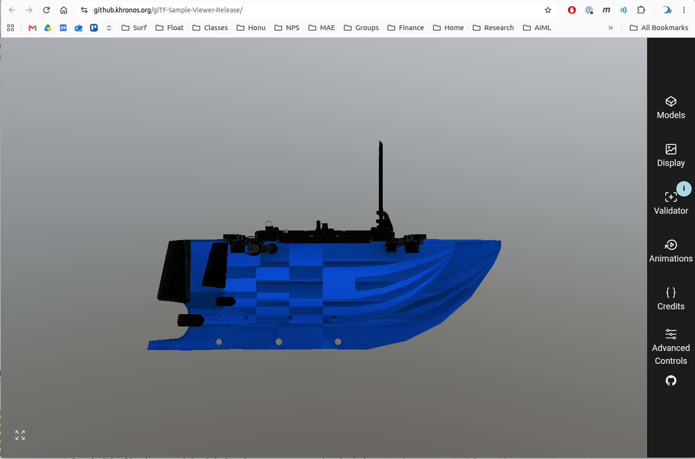
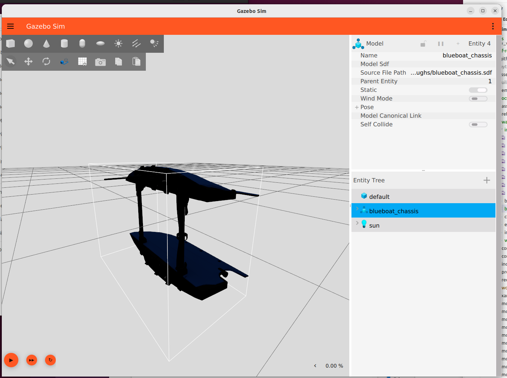
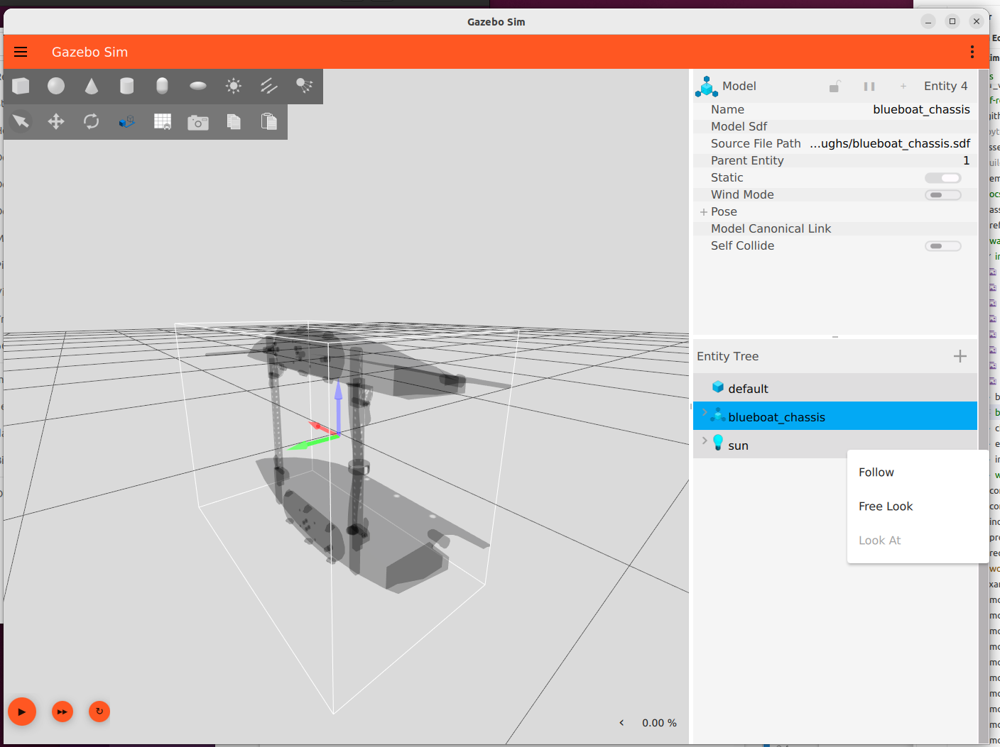
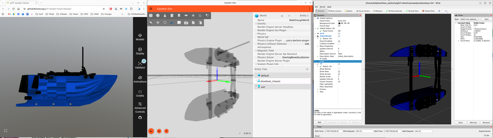

# BlueBoat Walkthrough


Following the new workflow

## Commission

- YAML file: /home/bsb/maritime_ws/src/bluerobotics_models/bluerobotics_parts/commissions/commission-blueboat_chassis.yaml
    - Document with text and photos, linked to YAML: /home/bsb/maritime_ws/src/bluerobotics_models/docs/vehicles/blueboat/visual_asset_commission.md

## Author 

## Fill manifest

Example, without installing the python executable

```bash
export GLB=~/maritime_ws/src/bluerobotics_models/bluerobotics_parts/models/blueboat_chassis/blueboat_chassis.visual.glb 

PYTHONPATH=src python3 -m gltf_robotics.manifest ~/maritime_ws/src/bluerobotics_models/bluerobotics_parts/commissions/commission-blueboat_chassis.yaml $GLB
```


## Verify

### Valid?

```
./gltf_validator -a -o $GLB
/home/bsb/maritime_ws/src/bluerobotics_models/bluerobotics_parts/models/blueboat_chassis/blueboat_chassis.visual.glb
Errors: 0, Warnings: 1, Infos: 1, Hints: 0
Time: 10ms

        Warnings:
                /meshes/0/primitives/0/material: Material requires a tangent space but the mesh primitive does not provide it. Runtime-generated tangent space may be non-portable across implementations.

        Infos:
                /extensionsUsed/0: Cannot validate an extension as it is not supported by the validator: 'KHR_xmp_json_ld'.

{
    "uri": "../../src/bluerobotics_models/bluerobotics_parts/models/blueboat_chassis/blueboat_chassis.visual.glb",
    "mimeType": "model/gltf-binary",
    "validatorVersion": "2.0.0-dev.3.10",
    "issues": {
        "numErrors": 0,
        "numWarnings": 1,
        "numInfos": 1,
        "numHints": 0,
        "messages": [
            {
                "code": "UNSUPPORTED_EXTENSION",
                "message": "Cannot validate an extension as it is not supported by the validator: 'KHR_xmp_json_ld'.",
                "severity": 2,
                "pointer": "/extensionsUsed/0"
            },
            {
                "code": "MESH_PRIMITIVE_GENERATED_TANGENT_SPACE",
                "message": "Material requires a tangent space but the mesh primitive does not provide it. Runtime-generated tangent space may be non-portable across implementations.",
                "severity": 1,
                "pointer": "/meshes/0/primitives/0/material"
            }
        ],
        "truncated": false
    },
    "info": {
        "version": "2.0",
        "generator": "Khronos glTF Blender I/O v5.1.20",
        "extensionsUsed": [
            "KHR_xmp_json_ld"
        ],
        "resources": [
            {
                "pointer": "/buffers/0",
                "mimeType": "application/gltf-buffer",
                "storage": "glb",
                "byteLength": 2985696
            },
            {
                "pointer": "/images/0",
                "mimeType": "image/jpeg",
                "storage": "buffer-view",
                "image": {
                    "width": 2048,
                    "height": 2048,
                    "format": "rgb",
                    "bits": 8
                }
            },
            {
                "pointer": "/images/1",
                "mimeType": "image/png",
                "storage": "buffer-view",
                "image": {
                    "width": 2048,
                    "height": 2048,
                    "format": "rgba",
                    "primaries": "srgb",
                    "transfer": "srgb",
                    "bits": 8
                }
            },
            {
                "pointer": "/images/2",
                "mimeType": "image/jpeg",
                "storage": "buffer-view",
                "image": {
                    "width": 2048,
                    "height": 2048,
                    "format": "rgb",
                    "bits": 8
                }
            }
        ],
        "animationCount": 0,
        "materialCount": 1,
        "hasMorphTargets": false,
        "hasSkins": false,
        "hasTextures": true,
        "hasDefaultScene": true,
        "drawCallCount": 1,
        "totalVertexCount": 10455,
        "totalTriangleCount": 10668,
        "maxUVs": 1,
        "maxInfluences": 0,
        "maxAttributes": 3
    }
}
```


### Intended

Drag and drop into https://github.khronos.org/glTF-Sample-Viewer-Release/



Shows we have Y-up, which is not as "intended"

### Compliant - gltf-check

```
bsb@hulihuli:~/maritime_ws/tools/gltf-robotics$ cd ~/maritime_ws/tools/gltf-robotics
bsb@hulihuli:~/maritime_ws/tools/gltf-robotics$ PYTHONPATH=src python3 -m gltf_robotics.check.cli $GLB
marks:
  PASS  the rule is satisfied
  FAIL  a MUST in the profile is violated; the delivery is not compliant
  WARN  a SHOULD is violated, or a MUST the file alone cannot settle; review before delivering
  OPEN  the profile has not settled this point (the profile's Open issues section); nothing to fix, something to discuss
  SKIP  nothing in the file for the rule to examine

This answers only the 'compliant' question of the profile's Conformance testing section:
does the file satisfy the rules that can be decided by reading it. Valid (Khronos
validator), intended (reference viewer) and usable (glb_probe, Gazebo, RViz) are
separate checks.

/home/bsb/maritime_ws/src/bluerobotics_models/bluerobotics_parts/models/blueboat_chassis/blueboat_chassis.visual.glb
  File naming: named <part>.visual.glb, with <part> in lowercase snake_case
    PASS  named blueboat_chassis.visual.glb
  File format: delivered as binary .glb rather than .gltf
    PASS  binary .glb container
  The manifest: carries a KHR_xmp_json_ld manifest, and its contents agree with the file
    PASS  manifest present, role base
  Asset header: asset header declares glTF 2.0 and no minVersion
    PASS  asset header is 2.0 with no minVersion
  Units: in meters at real-world scale, checked against the cited dimension
    PASS  length overall 1.2 m matches the X extent 1.192 m
  Axes: declares +X forward and +Z up, per ISO 9787 and REP 103
    PASS  declared +X forward, +Z up
  Scenes and nodes: exactly one scene and one named node, with no children and no transform
    FAIL  the root node has a Blender numeric suffix
          'blueboat_chassis.visual.001'
  Datum specification: names the datum point its origin is referenced to
    PASS  datum point: Intersection of three planes on the geometry mid-point as explained and illustrated in docs/vehicles/blueboat/configuration.md
  Geometry: every primitive is triangles carrying POSITION, NORMAL and TEXCOORD_0
    PASS  every primitive is triangles with POSITION, NORMAL, TEXCOORD_0
  UV sets: UV coordinates present, and inside the range 0 to 1
    PASS  1 UV set, inside [0, 1]
  Primitives: a primitive exists only to carry a material distinct from its siblings
    PASS  1 primitive, each carrying a distinct material
  Materials: every primitive has a material, with metalness stated rather than defaulted
    WARN  1 material leaves metallicFactor unset but carry an ORM map
          USV Mat (metallicFactor unset, so 1.0, metallicRoughness texture present).
          The texture's blue channel multiplies against the factor, so a black
          metallic channel would still yield a non-metal. Settling it needs the
          decoded texel values, which this tool does not read. Do not assume it is
          fine: a solid white metallic channel is the usual export, and every map
          measured in this project's own library had B = 255, which makes the part
          fully metal. State the factor explicitly if the part is not metal.
  Textures: textures are PNG in the linear slots and at most 2048 px on a side
    FAIL  2 linear maps are JPEG
          Normal-USV: JPEG in normal; Metallic-USV.png-Roughness-Blue-USV: JPEG in
          metallicRoughness. Chroma subsampling blends channels that are unrelated in
          a normal or ORM map. The remedy is a re-export from the source texture --
          converting a JPEG to PNG preserves the damage.
  Transparency: transparency declared per material: MASK for cutouts, never BLEND on an opaque part
    FAIL  USV Mat uses alphaMode BLEND
          Gazebo ignores BLEND and renders the material opaque; a cutout belongs in
          MASK with binary alpha
  Prohibited content: no prohibited extension, animation, skin, camera or light
    PASS  no prohibited extensions or content
  Authoring toolchain: records the exporter that produced it
    PASS  generator: Khronos glTF Blender I/O v5.1.20
  16 checks: 3 FAIL, 1 WARN, 12 PASS
  -> not compliant: 3 MUSTs are violated in Scenes and nodes, Textures, Transparency
```

#### gltf probe

In container
```
cd ~/maritime_ws/tools/gltf-robotics/probe/glb_probe 
cmake -S . -B build 
make --build build 
export GLB=~/maritime_ws/src/bluerobotics_models/bluerobotics_parts/models/blueboat_chassis/blueboat_chassis.visual.glb 
./build/glb_probe $GLB
```

```

===== /home/bsb/maritime_ws/src/bluerobotics_models/bluerobotics_parts/models/blueboat_chassis/blueboat_chassis.visual.glb
(2026-09-30 03:09:30.809) [debug] [AssimpLoader.cc:651] Loading embedded texture [/home/bsb/maritime_ws/src/bluerobotics_models/bluerobotics_parts/models/blueboat_chassis/blueboat_chassis.visual.glb#*0] as [/home/bsb/maritime_ws/src/bluerobotics_models/bluerobotics_parts/models/blueboat_chassis/blueboat_chassis.visual.glb#*0_Diffuse]
(2026-09-30 03:09:30.862) [debug] [AssimpLoader.cc:651] Loading embedded texture [/home/bsb/maritime_ws/src/bluerobotics_models/bluerobotics_parts/models/blueboat_chassis/blueboat_chassis.visual.glb#*1] as [/home/bsb/maritime_ws/src/bluerobotics_models/bluerobotics_parts/models/blueboat_chassis/blueboat_chassis.visual.glb#*1_MetallicRoughness]
(2026-09-30 03:09:30.887) [debug] [AssimpLoader.cc:494] Splitting MetallicRoughness map for [/home/bsb/maritime_ws/src/bluerobotics_models/bluerobotics_parts/models/blueboat_chassis/blueboat_chassis.visual.glb#*1]
(2026-09-30 03:09:30.985) [debug] [AssimpLoader.cc:651] Loading embedded texture [/home/bsb/maritime_ws/src/bluerobotics_models/bluerobotics_parts/models/blueboat_chassis/blueboat_chassis.visual.glb#*2] as [/home/bsb/maritime_ws/src/bluerobotics_models/bluerobotics_parts/models/blueboat_chassis/blueboat_chassis.visual.glb#*2_Normal]
bbox min -0.598506 -0.228827 -0.46236  max 0.593174 0.463013 0.46236
submeshes 1  materials 1  skeleton yes
  submesh[0] name='blueboat_chassis.visual.001' verts 10455 tris 10668 normals 10455 uvsets 1 material 0
    bounds min -0.598506 -0.228827 -0.46236  max 0.593174 0.463013 0.46236
  material[0] diffuse 1 1 1 1 transparency 0 alphaFromTexture 0 threshold 0.5 twoSided 0 emissive 0 0 0 1
    base color: /home/bsb/maritime_ws/src/bluerobotics_models/bluerobotics_parts/models/blueboat_chassis/blueboat_chassis.visual.glb#*0_Diffuse [2048x2048]
    pbr metalness 1 roughness 1
    normal:    /home/bsb/maritime_ws/src/bluerobotics_models/bluerobotics_parts/models/blueboat_chassis/blueboat_chassis.visual.glb#*2_Normal [2048x2048]
    metalness: /home/bsb/maritime_ws/src/bluerobotics_models/bluerobotics_parts/models/blueboat_chassis/blueboat_chassis.visual.glb#*1_Metalness [2048x2048]
    roughness: /home/bsb/maritime_ws/src/bluerobotics_models/bluerobotics_parts/models/blueboat_chassis/blueboat_chassis.visual.glb#*1_Roughness [2048x2048]
    emissive:  -
    lightmap:  - uvset 0
```

#### Gazebo standalone

Manual make SDF - see [./blueboat_chassis.sdf]

in drydock
```
gz sim -v2 ~/maritime_ws/tools/gltf-robotics/docs/walkthroughs/blueboat_chassis.sdf 
```




#### RVIZ

Manually create URDF - see [./blueboat_chassis.urdf].  Note that we undo the automatically applied "y-up" coordinate transform by including a rotation in the link
```
<link name="base_link">
    <visual><origin xyz="0 0 0" rpy="-1.5708 0 0"/>
      <geometry><mesh filename="file:///home/bsb/maritime_ws/src/bluerobotics_models/bluerobotics_parts/models/blueboat_chassis/blueboat_chassis.visual.glb"/></geometry></visual>
```

Two shells in drydock


```bash
ros2 run robot_state_publisher robot_state_publisher --ros-args \
  -p robot_description:="$(cat ~/maritime_ws/tools/gltf-robotics/docs/walkthroughs/blueboat_chassis.urdf)"
```

```bash
rviz2 -d ~/maritime_ws/tools/gltf-robotics/examples/monkey.rviz
```




From the gltf-robotics repo root, set PYTHONPATH to src and run the module:


cd ~/maritime_ws/tools/gltf-robotics
PYTHONPATH=src python3 -m gltf_robotics.check.cli ~/maritime_ws/src/bluerobotics_models/bluerobotics_parts/models/blueboat_chassis/blueboat_chassis.visual.glb
The same pattern covers all four tools:

Command	Module
gltf-check	gltf_robotics.check.cli
gltf-manifest	gltf_robotics.manifest
gltf-summary	gltf_robotics.summary
gltf-assess	gltf_robotics.assess.cli
Options work the same way, for example -q to show only the sections with something to report, or --json.